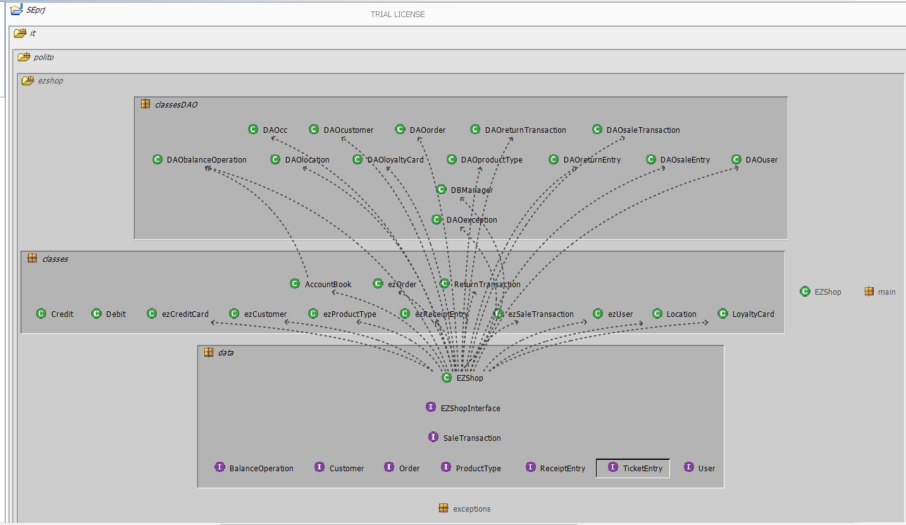
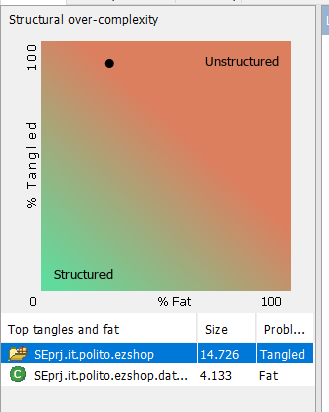
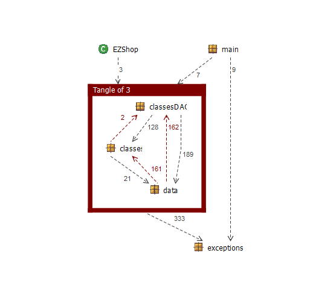

# Design assessment


```
<The goal of this document is to analyse the structure of your project, compare it with the design delivered
on April 30, discuss whether the design could be improved>
```


# Levelized structure map
```
<Applying Structure 101 to your project, version to be delivered on june 4, produce the Levelized structure map,
with all elements explosed, all dependencies, NO tangles; and report it here as a picture>
```



In the design document delivered we chose to implement the MVC pattern. Where we had the model being the classes, the controller being the EZShop that implements the functions needed to make the operations possible and the View that is the GUI. In the picture above we can see that the Controller is in the data package and it is not referenced in any other class. The "classes" package  contains all the classes we defined in the Class diagram in the design document. The "classesDAO" package is used to implement the persistency.
In the design we also have abstract classes and it is shown in the picture by some the classes that have no dependencies related to them, like Debit and Credit.


# Structural over complexity chart

```
<Applying Structure 101 to your project, version to be delivered on june 4, produce the structural over complexity chart; and report it here as a picture>
```


From this chart we can see that the tangle percentage is high but the fat percentage is lower. This means that even though we have a good cohesion.


# Size metrics

```
<Report here the metrics about the size of your project, collected using Structure 101>
```


| Metric                                    | Measure |
| ----------------------------------------- | ------- |
| Packages                                  |   8      |
| Classes (outer)                           |  59       |
| Classes (all)                             |  59       |
| NI (number of bytecode instructions)      |  15K       |
| LOC (non comment non blank lines of code) |  6K       |


# Items with XS

```
<Report here information about code tangles and fat packages>
```

| Item | Tangled | Fat  | Size | XS   |
| ---- | ------- | ---- | ---- | ---- |
| it.polito.ezshop     |  32%       | 10     |  15007    |    4085  |
| it.polito.ezshop.data     |         | 143     |  4133    |    664  |
| it.polito.ezshop.classesDAO     |         |  19    | 189     |  39    |


# Package level tangles

```
<Report screen captures of the package-level tangles by opening the items in the "composition perspective" 
(double click on the tangle from the Views->Complexity page)>
```


We can see the tangles between "classes" and "data" packages. But in reality they are not a real problems since the "data" package contains the interfaces of the classes in the "classes" package.

# Summary analysis
```
<Discuss here main differences of the current structure of your project vs the design delivered on April 30>
<Discuss if the current structure shows weaknesses that should be fixed>
```

The tangles can be reduced without increasing the Fat% by performing some simple changes like moving the usage of DAO classes from the classes in "classes" and use them in the "EZShop" class in the "data" package. Then since the "data" package includes the interfaces implemented in the "classes" package we could use a new, different package for the interfaces. This way we would reduce both the Fat% and the tangle%.  

