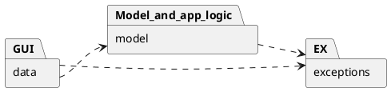

# Design Document 


Authors: Marcelo Coronel, Mostafa Asadollahy, Tommaso Natta, Zissis Tabouras 

Date: 28 april 2021

Version: #1


# Contents

- [High level design](#package-diagram)
- [Low level design](#class-diagram)
- [Verification traceability matrix](#verification-traceability-matrix)
- [Verification sequence diagrams](#verification-sequence-diagrams)

# Instructions

The design must satisfy the Official Requirements document, notably functional and non functional requirements

# High level design 

The <u><b>MVC</b></u> Design Pattern is used to perform separation of concers between the GUI and the model

The <u><b>3 tier</b></u> architecture is used to better separate the GUI from the Application Logic and the DB data (i.e. the Presentation should never interact directly with the DB but only throught the application logic in the middle.)
<report package diagram>



# Low level design

model package:

TODO: ~~FR1~~ (maybe user class), ~~FR3~~, ~~FR4~~, ~~FR5~~, <b>FR6</b>, ~~FR7~~, FR8,  (Ticket class)

<u><b>FR6</b></u>:  ~~FR6.1~~, ~~FR6.2~~, ~~FR6.3~~, ~~FR6.4~~, ~~FR6.5~~, ~~FR6.6~~, FR6.7,  ~~FR6.8~~, ~~FR6.9~~, ~~FR6.10~~, ~~FR6.11~~, ~~FR6.12~~, ~~FR6.13~~, ~~FR6.14~~, ~~FR6.15~~

```plantuml
left to right direction


class Shop{
    accountBalance
    Users
    productTypes
    saleTransactions
    ()_FR1
    -boolean : defineUser()
    -boolean : updateUser()
    -boolean : deleteUser()
    -List    : getAllUsers()
    -User    : getUser()
    -User : validateUser()  <returns User if found, null if not found>
    -boolean : setRights(UserID,right)
    ()_FR3
    Integer : createProductType()
    boolean : updateProduct()
    boolean : deleteProductType()
    List : getAllProductTypes()
    ProductType : getProductTypeByBarCode() FR6.7
    -ProductType : getProductTypeByProductCode()
    List : getProductTypesByDescription()
    ()_FR4
    boolean : updateQuantity() <of product in store>
    boolean : updatePosition() <of product in store>
    Integer : issueReorder()
    Integer : payOrderFor()
    boolean : payOrder()
    boolean : recordOrderArrival()
    List : getAllOrders()
    -double: getOrderCost()
    -boolean: updateOrderStatus()
    ()_FR5
    Integer : defineCustomer() ' <returns customer id>
    boolean : modifyCustomer()
    boolean : deleteCustomer()
    Customer : getCustomer()
    List : getAllCustomers()
    String : createCard()  ' <returns card code>
    boolean : attachCardToCustomer()
    Integer  : modifyPointsOnCard()
    ()_FR6
    Integer   : startSaleTransaction() '1 <creates instance>
    -boolean  : callAddProductToSale()
    -boolean  : callApplyDiscount()
    -boolean  : confirmSale()
    Ticket    : getTicketByNumber() '9
    boolean   : closeSaleTransaction() '10
    Integer   : startReturnTransaction() '12
    boolean   : returnProduct() '13
    boolean   : deleteReturnTransaction() '15
    boolean   : deleteSaleTicket()
    ticket    : getSaleTicket()
    int       : computePointsForSale()
    boolean   : closeSaleTransaction()
    ()_FR7
    -boolean : readCreditCard()
    -boolean : validateCreditCard()
    -boolean : validateCCBalance()
    double  : computeCashQuantity()
    double  : receiveCashPayment()
    boolean : receiveCreditCardPayment()
    double  : returnCashPayment()
    double  : returnCreditCardPayment()

}
class User{
    ID
    Name
    Surname
    Date of birth
    Address
    Password
    Username
    Role
}
User "*"-l Shop


class AccountBook{
    Balance
    ()_FR8
    boolean: recordBalanceUpdate() '1,'2
    List: getCreditsAndDebits() '3
    double: computeBalance() '4
}
AccountBook - Shop

interface FinancialTransaction {
    description
    amount
    date
}
AccountBook -- "*" FinancialTransaction

abstract class Credit 
abstract class Debit

Credit --|> FinancialTransaction
Debit --|> FinancialTransaction

class Sale
class Return

Order --|> Debit
Sale --|> Credit
Return --|> Debit


class ProductType{
    barCode
    description
    sellPrice
    quantity
    discountRate
    notes
}

Shop - "*" ProductType

class SaleTransaction {
    ID 
    date
    time
    cost
    paymentType
    discount rate
    loyalityCardCodes
    customerIds
    ()_FR6
    boolean   : addProductToSale() '2
    boolean   : deleteProductFromSale() '3
    boolean   : applyDiscountRateToSale() '4
    boolean   : applyDiscountRateToProduct() '5 
    int       : computePointsForSale() '6
    


}
Shop --"*" SaleTransaction
SaleTransaction - "*" ProductType

class SaleTicket{
    ticketNumber
    ()_FR6
    -boolean   : printSaleTicket() '8
}
SaleTransaction -- SaleTicket

class Quantity {
    quantity
}
(SaleTransaction, ProductType)  .. Quantity

class LoyaltyCard {
    ID
    points
    ()_FR5
    boolean :attachCustomer() '6
}

class Customer {
    name
    surname
}

LoyaltyCard "0..1" - Customer

SaleTransaction "*" -- "0..1" LoyaltyCard

class Product {
    
}

class Position {
    aisleID
    rackID
    levelID
}

ProductType - "0..1" Position

ProductType -- "*" Product : describes

class Order {
  supplier
  pricePerUnit
  quantity
  status
  -double: computeCost()
}
Order "*" -- Shop
Order "*" - ProductType

class ReturnTransaction {
  quantity
  returnedValue
  ()_FR6
  boolean   : endReturnTransaction() '14
}

ReturnTransaction "*" - SaleTransaction
ReturnTransaction "*" - ProductType

note "ID is a number on 10 digits " as N1  
N1 .. LoyaltyCard
note "bar code is a number on 12 to 14  digits, compliant to GTIN specifications, see  https://www.gs1.org/services/how-calculate-check-digit-manually " as N2  
N2 .. ProductType
note "ID is a unique identifier of a transaction,  printed on the receipt (ticket number) " as N3
N3 .. SaleTransaction

note "stored on DB" as S1
S1 .. LoyaltyCard

note "stored on DB" as S2
S2 .. Customer

note "stored on DB" as S3
S3 .. ProductType

note "stored on DB" as S4
S4 .. User
```


# Verification traceability matrix

\<for each functional requirement from the requirement document, list which classes concur to implement it>

| |Shop|User|Account<br/>Book|Financial<br/>Transaction|Credit|Debit|Sale|Return|Product<br/>Type|Sale<br/>Transaction| Return<br/>Transaction |Quantity|Loyalty<br/>Card|Customer| Product | Position  | Order | Sale<br/>Ticket
|:-------|:-------:|:-------:|:-------:|:-------:|:-------:|:-------:|:-------:|:-------:|:-------:|:-------:|:-------:|:-------:|:-------:|:-------:|:-------:|:-------:|:-------:|:-------:|
| FR.1 | X |X |  |  |  |  |  |  |  |  |  |  |  |  |  |  |  |  |
| FR.3 | X |  |  |  |  |  |  |  |X |  |  |  |  |  |X |X |  |  |
| FR.4 | X |  |  |  |  |  |X |  |X |  |  |X |  |  |  |X |X |  |
| FR.5 | X |  |  |  |  |  |  |  |  |  |  |  |X |X |  |  |  |  |
| FR.6 | X |  |  |  |  |  |(X)|X|X |X |X |X |  |  |X |  |  |X |
| FR.7 | X |  |  |X |X |X |X |X |  |  |  |  |  |  |  |  |  |  |
| FR.8 | X |X |  | |  |  |  |  |  |  |  |  |  |  |  |  |  |  |
||


# Verification sequence diagrams 
\<select key scenarios from the requirement document. For each of them define a sequence diagram showing that the scenario can be implemented by the classes and methods in the design>

```plantuml

title
scenario 1-1: Create product type X
end title

actor User
Boundary View
User -> View: create product
View->Shop: createProductType(description,productCode, pricePerUnit, note)
Shop -> Product_type: createProduct()
Product_type -> Product_type: setDescription()
Product_type -> Product_type: setBarCode()
Product_type -> Product_type: setUnitPrice()
Product_type -> Product_type: setNotes()
Product_type -> Product_type: setPosition()
Product_type --> Shop: productID
```
```plantuml

title
scenario 1-2: Modify product type location
end title

actor User
Boundary View
User -> View: search product by Barcode
View->Shop: getProductTypeByBarCode(barCode)
Shop -> Shop: getProductTypeByBarCode()
Shop --> View: Show product
User -> View: change product position
View->Shop: updatePosition(productId, newPos)
Shop -> Product_type: updatePosition()
Product_type -> Product_type: setPosition()
Product_type --> Shop: return

```
```plantuml

title
scenario 1-3: Modify product type price per unit
end title

actor User
Boundary View
User -> View: search product by Barcode
View->Shop: getProductTypeByBarCode(barCode)
Shop -> Shop: getProductTypeByBarCode()
Shop --> View: Show product
User -> View: change price
View->Shop: updateProduct(id,newDescription,newCode, newPrice, newNote)
Shop -> Product_type: updateProduct()
Product_type -> Product_type: setPrice()
Product_type --> Shop: outcome

```
```plantuml

title
scenario 2-1: Create user and define rights
end title

actor User
Boundary View
User -> View: give credentials and role of new user 
View->Shop: createUser(username, password, role)
Shop -> Shop: defineUser()

```
```plantuml

title
scenario 2-2: Delete user
end title

actor User
Boundary View
User -> View: delete user 
View->Shop: deleteUser(id) 
Shop -> Shop: deleteUser() 

```
```plantuml

title
scenario 2-3: Modify user rights
end title

actor User
Boundary View
User -> View: give new right to user 
View->Shop: updateUserRights(id, role)
Shop -> User_record: setRights()
User_record --> Shop: outcome

```

```plantuml

title
scenario 3-1: Order of product type X issued
end title

actor ShopManager
Boundary Order_View
ShopManager -> Order_View: Create order for X
ShopManager -> Order_View: input quantity, procePerUnit
Order_View->Shop: issueReorder(productCode,quantity,pricePerUnit)
Shop -> Product_type: getProductTypeProductCode()
Product_type->Order: createOrder(quantity,pricePerUnit)
Order->Order: setStatus(issued) 
Order --> Product_type: Order_Code
Product_type -->Shop: Order_code
Shop-->Order_View: Order_code 

```

```plantuml

title
scenario 3-2: Order of product X payed
end title

actor ShopManager
Boundary Order_View
ShopManager -> Order_View: pay order O for product X
Order_View->Shop: payOrder(orderId)
Shop->Shop: payOrder()
Shop->Order: getOrderCost()
Order->Order: computeCost()
Order-->Shop: Amount_to_be_payed
Shop->AccountBook: recordBalanceUpdate(Amount_to_be_payed)
AccountBook-->Shop: positive_outcome
Shop->Order: updateOrderStatus()
Order->Order: setStatus(payed) 
Order --> Shop: outome
Shop-->Order_View: payment_outcome 

```


```plantuml

title 
**Scenario 4.1** : Create customer record
end title

actor User
Boundary View
User -> View: ask customer personal data
View -> Shop: fill customer data
Shop -> user: defineCustomer()
user --> View: returns customer id

```


```plantuml


title 
**Scenario 4.2** : Attach Loyalty card to customer record
end title

actor User
Boundary View
User -> Shop: CreateCard()
Shop --> View: returns card code 
Shop -> Loyalty_card: attachCardToCustomer()
Loyalty_card -> Customer: attachCustomer()


```


```plantuml

title 
**Scenario 4.3** : Detach Loyalty card from customer record
end title

actor User
Boundary View
User -> Shop: getCustomer()
Shop --> View: returns customer account
Shop -> Loyalty_card: modifyPointsOnCard()
Loyalty_card --> Shop: return
Shop --> View: Update


```


```plantuml

title 
**Scenario 4.4** : Update customer record
end title

actor User
Boundary View
User -> Shop: getCustomer()
Shop --> View: returns customer account
Shop -> Customer: ModifyCustomer()
Customer --> Shop: return 
Shop --> View: Update 


```


```plantuml


title 
**Scenario 5.1** : Login
end title

actor User
Boundary View
User -> View: Enter username
User -> View: Enter password
View -> Shop:getUser(username,password)
Shop -> user: getUser()
user -> user: validateUser()
user --> Shop: return user
Shop --> View: User view

```


```plantuml

title 
**Scenario 5.2** : Logout
end title

actor User
Boundary View
User -> View: logout
View -> Shop:log_out()
Shop -> View: log in/sign in view


```


```plantuml


title
**Scenario 6.1** : Sale of product type X is completed
end title

actor Cashier
Boundary CartView
boundary PaymentView
Cashier -> CartView: Start sale transaction
CartView -> Shop: StartSaleTransaction()
Shop --> CartView: return transaction ID
Cashier -> CartView: Use scanner
CartView ->  Shop: getProductTypeByBarCode(barCode) 
Shop --> CartView: return Product Type

Cashier -> CartView: Set amount
Cashier -> CartView: Add to Sale Transaction
CartView -> Shop: callAddProductToSale
Shop -> SaleTransaction: AddProductToSale(transactionID,productCode,amount)
SaleTransaction --> Shop: return
Shop --> CartView: Update View

Cashier -> CartView: Close transaction
CartView -> Shop: closeSaleTransaction(id)
Shop --> Shop: return successfulness
Shop --> PaymentView: Render PaymentView
Cashier -> PaymentView: Manage Payment (UC7)
PaymentView -> Shop :
Shop --> PaymentView :
PaymentView -> Shop :
Shop --> PaymentView :
PaymentView -> Shop :
Shop --> PaymentView : return payment successfulness
Cashier -> PaymentView: Confirm Sale
PaymentView -> Shop: getSaleTicket()
Shop -> SaleTicket: printSaleTicket()
SaleTicket --> Shop: return
Shop -> AccountBook: UpdateBalance()
AccountBook --> Shop: return

```


```plantuml

title
**Scenario 6.2** : Sale of product type X with product discount
end title

actor Cashier
Boundary CartView
boundary PaymentView
Cashier -> CartView: Start sale transaction
CartView -> Shop: StartSaleTransaction()
Shop --> CartView: return transaction ID
Cashier -> CartView: Use scanner
CartView ->  Shop: getProductTypeByBarCode(barCode) 
Shop --> CartView: return Product Type

Cashier -> CartView: Set amount
Cashier -> CartView: Add to Sale Transaction
CartView -> Shop: callAddProductToSale()
Shop -> SaleTransaction: AddProductToSale(transactionID,productCode,amount)
SaleTransaction --> Shop: return
Shop --> CartView: Update view

Cashier -> CartView: Apply discount to Product
CartView -> Shop: callApplyDiscount()
Shop -> SaleTransaction: applyDiscountRateToProduct(,,)
SaleTransaction --> Shop: return successfulness
Shop --> CartView: Update view

Cashier -> CartView: Close transaction
CartView -> Shop: closeSaleTransaction(id)
Shop --> Shop: return successfulness
Shop --> PaymentView: Render PaymentView
Cashier -> PaymentView: Manage Payment (UC7)
PaymentView -> Shop :
Shop --> PaymentView :
PaymentView -> Shop :
Shop --> PaymentView :
PaymentView -> Shop :
Shop --> PaymentView : return payment successfulness
Cashier -> PaymentView: Confirm Sale
PaymentView -> Shop: getSaleTicket()
Shop -> SaleTicket: printSaleTicket()
SaleTicket --> Shop: return
Shop -> AccountBook: UpdateBalance()
AccountBook --> Shop: return
```


```plantuml

title
**Scenario 6.3** : Sale of product type X with sale discount
end title

actor Cashier
Boundary CartView
boundary PaymentView
Cashier -> CartView: Start sale transaction
CartView -> Shop: StartSaleTransaction()
Shop --> CartView: return transaction ID
Cashier -> CartView: Use scanner
CartView ->  Shop: F(barCode) 
Shop --> CartView: return Product Type

Cashier -> CartView: Set amount
Cashier -> CartView: Add to Sale Transaction
CartView -> Shop: callAddProductToSale()
Shop -> SaleTransaction: AddProductToSale(transactionID,productCode,amount)
SaleTransaction --> Shop: return
Shop --> CartView: Update view

Cashier -> CartView: Apply discount to sale
CartView -> Shop: callApplyDiscount()
Shop -> SaleTransaction: applyDiscountRateToSale(,)
SaleTransaction --> Shop: return successfulness
Shop --> CartView: Update view

Cashier -> CartView: Close transaction
CartView -> Shop: closeSaleTransaction(id)
Shop --> Shop: return successfulness
Shop --> PaymentView: Render PaymentView
Cashier -> PaymentView: Manage Payment (UC7)
PaymentView -> Shop :
Shop --> PaymentView :
PaymentView -> Shop :
Shop --> PaymentView :
PaymentView -> Shop :
Shop --> PaymentView : return payment successfulness
Cashier -> PaymentView: Confirm Sale
PaymentView -> Shop: getSaleTicket()
Shop -> SaleTicket: printSaleTicket()
SaleTicket --> Shop: return
Shop -> AccountBook: UpdateBalance()
AccountBook --> Shop: return
```


```plantuml

title
**scenario 6.4** : Sale of product type X with Loyalty Card Update
end title

'Actors
actor Cashier
'Boundaries
Boundary CartView
boundary PaymentView

''''
'Sequence
'''''
'Start sale transaction
Cashier -> CartView: Start sale transaction
CartView -> Shop: StartSaleTransaction()
Shop --> CartView: return transaction ID
Cashier -> CartView: Use scanner
CartView ->  Shop: getProductTypeByBarCode(barCode) 
Shop --> CartView: return Product Type

'Set amount and Add product
Cashier -> CartView: Set amount
Cashier -> CartView: Add to Sale Transaction
CartView -> Shop: callAddProductToSale()
Shop -> SaleTransaction: AddProductToSale(transactionID,productCode,amount)
SaleTransaction --> Shop: return
Shop --> CartView: Update view

'Close transaction
Cashier -> CartView: Close transaction
CartView -> Shop: closeSaleTransaction(id)
Shop --> Shop: return successfulness
'Payment
Shop --> PaymentView: Render PaymentView
Cashier -> PaymentView: Select payment type
'Add points to Loyalty card
Cashier -> PaymentView: Read Loyalty card
PaymentView -> Shop: computePointsForSale(transactionID)
Shop --> PaymentView : Update View

'Manage credit card payment UC3
Cashier -> PaymentView: Manage credit card payment (UC3)
PaymentView -> Shop :
Shop --> PaymentView :
PaymentView -> Shop :
Shop --> PaymentView :
PaymentView -> Shop :
Shop --> PaymentView : return payment successfulness

'Update card points
Shop -> LoyaltyCard: modifyPointsOnCard(card,points)
LoyaltyCard --> Shop: return

'Confirm Sale
Cashier -> PaymentView: Confirm Sale
PaymentView -> Shop: getSaleTicket()
'Print ticket
Shop -> SaleTicket: printSaleTicket()
SaleTicket --> Shop: return
'Update balance
Shop -> AccountBook: UpdateBalance()
AccountBook --> Shop: return
```

```plantuml

title
**Scenario 6.5** : Sale of product type X cancelled
end title

'Actors
actor Cashier
'Boundaries
Boundary CartView
boundary PaymentView

''''
'Sequence
'''''
'Start sale transaction
Cashier -> CartView: Start sale transaction
CartView -> Shop: StartSaleTransaction()
Shop --> CartView: return transaction ID
Cashier -> CartView: Use scanner
CartView ->  Shop: getProductTypeByBarCode(barCode) 
Shop --> CartView: return Product Type

'Set amount and Add product
Cashier -> CartView: Set amount
Cashier -> CartView: Add to Sale Transaction
CartView -> Shop: callAddProductToSale()
Shop -> SaleTransaction: AddProductToSale(transactionID,productCode,amount)
SaleTransaction --> Shop: return
Shop --> CartView: Update view

'Close transaction
Cashier -> CartView: Close transaction
CartView -> Shop: closeSaleTransaction(id)
Shop --> Shop: return successfulness
'Payment
Shop --> PaymentView: Render PaymentView
Cashier -> PaymentView: Select payment type

'Cancel the payment
Cashier -> PaymentView: Cancel sale transaction
PaymentView -> Shop: deleteSaleTicket(ticketNumber)
Shop --> CartView: Render CartView

```

```plantuml

title
**Scenario 6.6** : Sale of product type X completed (cash)
end title

'Actors
actor Cashier
'Boundaries
Boundary CartView
boundary PaymentView
boundary SaleReview

''''
'Sequence
'''''
'Start sale transaction
Cashier -> CartView: Start sale transaction
CartView -> Shop: StartSaleTransaction()
Shop --> CartView: return transaction ID
Cashier -> CartView: Use scanner
CartView ->  Shop: getProductTypeByBarCode(barCode) 
Shop --> CartView: return Product Type
 
'Set amount and Add product
Cashier -> CartView: Set amount
Cashier -> CartView: Add to Sale Transaction
CartView -> Shop: callAddProductToSale()
Shop -> SaleTransaction: AddProductToSale(transactionID,productCode,amount)
SaleTransaction --> Shop: return
Shop --> CartView: Update view

'Close transaction
Cashier -> CartView: Close transaction
CartView -> Shop: closeSaleTransaction(id)
Shop --> Shop: return successfulness

'Sell review
Shop --> SaleReview: Render SaleReview
Cashier -> SaleReview: Confirm sale
SaleReview -> Shop: confirmSale()
'Payment
Shop --> PaymentView: Render PaymentView
Cashier -> PaymentView: Select payment type

'Manage cash payment UC7
Cashier -> PaymentView: Manage cash payment (UC7)
PaymentView -> Shop :
Shop --> PaymentView :
PaymentView -> Shop :
Shop --> PaymentView :
PaymentView -> Shop :
Shop --> PaymentView : return payment successfulness

'Confirm Sale
Cashier -> PaymentView: Confirm Sale
PaymentView -> Shop: getSaleTicket()
'Print ticket
Shop -> SaleTicket: printSaleTicket()
SaleTicket --> Shop: return
'Update balance
Shop -> AccountBook: UpdateBalance()
AccountBook --> Shop: return

```


```plantuml

title
**Scenario 7.1** : Manage payment by valid credit card
end title

'Actors
actor CreditCardCircuit
'Boundaries
boundary PaymentView

''''
'Sequence
'''''
'Read credit card number
CreditCardCircuit -> PaymentView: Read CC number
PaymentView -> Shop : readCreditCard()
'MISSINGFUNCTION validateCreditCard()
Shop -> Shop: validateCreditCard()'
Shop -> SaleTransaction: getCost()
SaleTransaction --> Shop: return
Shop -> Shop: receiveCreditCardPayment(SaleTicketID,ccn)
Shop --> PaymentView: Update View

```
```plantuml
title
**Scenario 7.2** : Manage payment by invalid credit card
end title

'Actors
actor CreditCardCircuit
'Boundaries
boundary PaymentView

''''
'Sequence
'''''
'Read credit card number
CreditCardCircuit -> PaymentView: Read CC number
'MISSINGFUNCTION readCreditCard()
PaymentView -> Shop : readCreditCard()
'MISSINGFUNCTION validateCreditCard()
Shop -> Shop: validateCreditCard()
Shop --> PaymentView: Update View WARNING: Invalid Card

```
```plantuml
title
**Scenario 7.3** : Manage credit card payment with not enough credit
end title

'Actors
actor CreditCardCircuit
'Boundaries
boundary PaymentView

''''
'Sequence
'''''
'Read credit card number
CreditCardCircuit -> PaymentView: Read CC number
'MISSINGFUNCTION readCreditCard()
PaymentView -> Shop : readCreditCard
'MISSINGFUNCTION validateCreditCard()
Shop -> Shop: validateCreditCard()
Shop -> SaleTransaction: getCost()
SaleTransaction --> Shop: return
'MISSINGFUNCTION validateCCBalance()
Shop -> Shop : validateCCBalance()
Shop --> PaymentView: Update View WARNING: Balance insufficient

```

```plantuml
title
**Scenario 7.4** : Manage cash payment
end title

'Actors
actor Cashier
'Boundaries
boundary PaymentView

''''
'Sequence
'''''
Cashier -> PaymentView: Collect coins
'MISSINGFUNCTION
PaymentView -> Shop: computeCashQuantity()
'receveCashPayment includes the recording of the payment and the computation of the change
Shop -> Shop: receiveCashPayment(ticketnumber, cash)
Shop --> Shop: return Change
Shop --> PaymentView: Update View

```

```plantuml

title
**scenario 8.1** : Return transaction of product type X completed, credit card
end title

Actor Cashier
Boundary returnView
Cashier -> Shop: Insert ticket number
Shop -> ReturnTransaction: startReturnTransasction()
ReturnTransaction --> cashierView: ask for product
Cashier -> Shop: read barcode of product
Cashier -> Shop: insert number of units to return
Shop -> ProductType: setQuantity()
Shop -> Shop: manage credit card return (UC10)
Cashier -> Shop: confirm return transaction
Shop -> ReturnTransaction: endReturnTransaction()
Shop -> AccountBook: recordBalanceUpdate()
```


```plantuml

title
**scenario 8.2** : Return transaction of product type X completed, cash
end title

Actor Cashier
Boundary returnView
Cashier -> Shop: Insert ticket number
Shop -> ReturnTransaction: startReturnTransasction()
ReturnTransaction --> cashierView: ask for product
Cashier -> Shop: read barcode of product
Cashier -> Shop: insert number of units to return
Shop -> ProductType: setQuantity()
Shop -> Shop: manage cash return (UC10)
Cashier -> Shop: confirm return transaction
Shop -> ReturnTransaction: endReturnTransaction()
Shop -> AccountBook: recordBalanceUpdate()
```
 
 
```plantuml

title
**scenario 9.1** : List credits and debits
end title

Actor Manager
Boundary listView
Manager -> listView: select start date 
Manager -> listView: select end date 
Manager -> listView: confirm
listView -> AccountBook: getCreditsAndDebits()
AccountBook-> listView: return filtered list

```


```plantuml

title
**scenario 10.1** : Return payment by  credit card
end title

Actor Employee
Boundary returnView
Employee -> Shop: input Credit card number
Shop -> returnView: validate number
Employee -> Shop: input amount to return
Shop -> Employee: return amount

```


```plantuml

title
**scenario 10.2** : return  cash payment
end title

Actor Employee

Boundary returnView
Employee ->Employee: collects money
Employee -> Shop: record cash return

```


