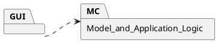

# Design Document 


Authors: Marcelo Coronel, Mostafa Asadollahy, Tommaso Natta, Zissis Tabouras 

Date: 28 april 2021

Version: #1


# Contents

- [High level design](#package-diagram)
- [Low level design](#class-diagram)
- [Verification traceability matrix](#verification-traceability-matrix)
- [Verification sequence diagrams](#verification-sequence-diagrams)

# Instructions

The design must satisfy the Official Requirements document, notably functional and non functional requirements

# High level design 

The <u><b>MVC</b></u> Design Pattern is used to perform separation of concers between the GUI and the model

The <u><b>3 tier</b></u> architecture is used to better separate the GUI from the Application Logic and the DB data (i.e. the Presentation should never interact directly with the DB but only throught the application logic in the middle.)
<report package diagram>



# Low level design

<for each package, report class diagram>

MC package:

TODO: ~~FR1~~ (maybe user class), ~~FR3~~, ~~FR4~~, ~~FR5~~, <b>FR6</b>, ~~FR7~~, FR8,  (Ticket class)

<u><b>FR6</b></u>:  ~~FR6.1~~, ~~FR6.2~~, ~~FR6.3~~, ~~FR6.4~~, ~~FR6.5~~, ~~FR6.6~~, FR6.7,  ~~FR6.8~~, ~~FR6.9~~, ~~FR6.10~~, ~~FR6.11~~, ~~FR6.12~~, ~~FR6.13~~, ~~FR6.14~~, ~~FR6.15~~

```plantuml
left to right direction


class Shop{
    accountBalance
    Users
    productTypes
    saleTransactions
    ()_FR1
    -boolean : defineUser()
    -boolean : updateUser()
    -boolean : deleteUser()
    -List    : getAllUsers()
    -User    : getUser()
    -User : validateUser()  <returns User if found, null if not found>
    -boolean : setRights(UserID,right)
    ()_FR3
    Integer : createProductType()
    boolean : updateProduct()
    boolean : deleteProductType()
    List : getAllProductTypes()
    ProductType : getProductTypeByBarCode() FR6.7
    List : getProductTypesByDescription()
    ()_FR4
    boolean : updateQuantity() <of product in store>
    boolean : updatePosition() <of product in store>
    Integer : issueReorder()
    Integer : payOrderFor()
    boolean : payOrder()
    boolean : recordOrderArrival()
    List : getAllOrders()
    ()_FR5
    Integer : defineCustomer() ' <returns customer id>
    boolean : modifyCustomer()
    boolean : deleteCustomer()
    Customer : getCustomer()
    List : getAllCustomers()
    String : createCard()  ' <returns card code>
    boolean : attachCardToCustomer()
    Integer  : modifyPointsOnCard()
    ()_FR6
    Integer   : startSaleTransaction() '1 <creates instance>
    Ticket    : getTicketByNumber() '9
    boolean   : closeSaleTransaction() '10
    Integer   : startReturnTransaction() '12
    boolean   : returnProduct() '13
    boolean   : deleteReturnTransaction() '15
    boolean   : deleteSaleTicket()
    ticket    : getSaleTicket()
    int       : computePointsForSale()
    boolean   : closeSaleTransaction()
    ()_FR7
    double  : receiveCashPayment()
    boolean : receiveCreditCardPayment()
    double  : returnCashPayment()
    double  : returnCreditCardPayment()

}
class User{
    ID
    Name
    Surname
    Date of birth
    Address
    Password
    Username
    Role
}
User "*"-l Shop


class AccountBook{
    ()_FR8
    boolean: recordBalanceUpdate() '1,'2
    List: getCreditsAndDebits() '3
    double: computeBalance() '4
}
AccountBook - Shop

class FinancialTransaction {
    description
    amount
    date
}
AccountBook -- "*" FinancialTransaction

class Credit 
class Debit

Credit --|> FinancialTransaction
Debit --|> FinancialTransaction

class Order
class Sale
class Return

Order --|> Debit
Sale --|> Credit
Return --|> Debit


class ProductType{
    barCode
    description
    sellPrice
    quantity
    discountRate
    notes
}

Shop - "*" ProductType

class SaleTransaction {
    ID 
    date
    time
    cost
    paymentType
    discount rate
    loyalityCardCodes
    customerIds
    ()_FR6
    boolean   : addProductToSale() '2
    boolean   : deleteProductFromSale() '3
    boolean   : applyDiscountRateToSale() '4
    boolean   : applyDiscountRateToProduct() '5 
    int       : computePointsForSale() '6
    


}
Shop --"*" SaleTransaction
SaleTransaction - "*" ProductType

class SaleTicket{
    ticketNumber
    ()_FR6
    -boolean   : printSaleTicket() '8
}
SaleTransaction -- SaleTicket

class Quantity {
    quantity
}
(SaleTransaction, ProductType)  .. Quantity

class LoyaltyCard {
    ID
    points
    ()_FR5
    boolean :attachCustomer() '6
}

class Customer {
    name
    surname
}

LoyaltyCard "0..1" - Customer

SaleTransaction "*" -- "0..1" LoyaltyCard

class Product {
    
}

class Position {
    aisleID
    rackID
    levelID
}

ProductType - "0..1" Position

ProductType -- "*" Product : describes

class Order {
  supplier
  pricePerUnit
  quantity
  status
}

Order "*" - ProductType

class ReturnTransaction {
  quantity
  returnedValue
  ()_FR6
  boolean   : endReturnTransaction() '14
}

ReturnTransaction "*" - SaleTransaction
ReturnTransaction "*" - ProductType

note "ID is a number on 10 digits " as N1  
N1 .. LoyaltyCard
note "bar code is a number on 12 to 14  digits, compliant to GTIN specifications, see  https://www.gs1.org/services/how-calculate-check-digit-manually " as N2  
N2 .. ProductType
note "ID is a unique identifier of a transaction,  printed on the receipt (ticket number) " as N3
N3 .. SaleTransaction

```


# Verification traceability matrix

\<for each functional requirement from the requirement document, list which classes concur to implement it>

| |Shop|User|Account<br/>Book|Financial<br/>Transaction|Credit|Debit|Sale|Return|Product<br/>Type|Sale<br/>Transaction| Return<br/>Transaction |Quantity|Loyalty<br/>Card|Customer| Product | Position  | Order | Sale<br/>Ticket
|:-------|:-------:|:-------:|:-------:|:-------:|:-------:|:-------:|:-------:|:-------:|:-------:|:-------:|:-------:|:-------:|:-------:|:-------:|:-------:|:-------:|:-------:|:-------:|
| FR.1 | X |X |  |  |  |  |  |  |  |  |  |  |  |  |  |  |  |  |
| FR.3 | X |  |  |  |  |  |  |  |X |  |  |  |  |  |X |X |  |  |
| FR.4 | X |  |  |  |  |  |X |  |X |  |  |X |  |  |  |X |X |  |
| FR.5 | X |  |  |  |  |  |  |  |  |  |  |  |X |X |  |  |  |  |
| FR.6 | X |  |  |  |  |  |(X)|X|X |X |X |X |  |  |X |  |  |X |
| FR.7 | X |  |  |X |X |X |X |X |  |  |  |  |  |  |  |  |  |  |
| FR.8 | X |X |  | |  |  |  |  |  |  |  |  |  |  |  |  |  |  |
||


# Verification sequence diagrams 
\<select key scenarios from the requirement document. For each of them define a sequence diagram showing that the scenario can be implemented by the classes and methods in the design>

```plantuml

title
scenario 1-1: Create product type X
end title

actor User
Boundary View
User -> View: create product
View->Shop: createProductType(description,productCode, pricePerUnit, note)
Shop -> Product_type: createProduct()
Product_type -> Product_type: setDescription()
Product_type -> Product_type: setBarCode()
Product_type -> Product_type: setUnitPrice()
Product_type -> Product_type: setNotes()
Product_type -> Product_type: setPosition()
Product_type --> Shop: productID
```
```plantuml

title
scenario 1-2: Modify product type location
end title

actor User
Boundary View
User -> View: search product by Barcode
View->Shop: getProductTypeByBarCode(barCode)
Shop -> Shop: getProductTypeByBarCode()
Shop --> View: Show product
User -> View: change product position
View->Shop: updatePosition(productId, newPos)
Shop -> Product_type: updatePosition()
Product_type -> Product_type: setPosition()
Product_type --> Shop: return

```
```plantuml

title
scenario 1-3: Modify product type price per unit
end title

actor User
Boundary View
User -> View: search product by Barcode
View->Shop: getProductTypeByBarCode(barCode)
Shop -> Shop: getProductTypeByBarCode()
Shop --> View: Show product
User -> View: change price
View->Shop: updateProduct(id,newDescription,newCode, newPrice, newNote)
Shop -> Product_type: updateProduct()
Product_type -> Product_type: setPrice()
Product_type --> Shop: outcome

```
```plantuml

title
scenario 2-1: Create user and define rights
end title

actor User
Boundary View
User -> View: give credentials and role of new user 
View->Shop: createUser(username, password, role)
Shop -> Shop: defineUser()

```
```plantuml

title
scenario: Log-in, Log out
end title

actor User
Boundary View
User -> View: log-in
View->Shop: log_in(username, password)
Shop -> Shop: validateUser()
Shop --> View: User view

User -> View: log-out
View->Shop: log_out()
Shop --> View: log-out view

```
```plantuml

title
scenario 2-2: Delete user
end title

actor User
Boundary View
User -> View: delete user 
View->Shop: deleteUser(id) 
Shop -> Shop: deleteUser() 

```
```plantuml

title
scenario 2-3: Modify user rights
end title

actor User
Boundary View
User -> View: give new right to user 
View->Shop: updateUserRights(id, role)
Shop -> User_record: setRights()
User_record --> Shop: outcome

```