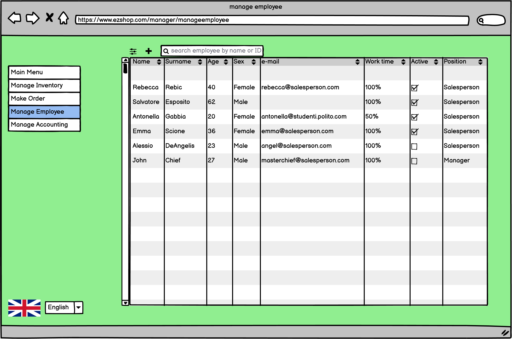
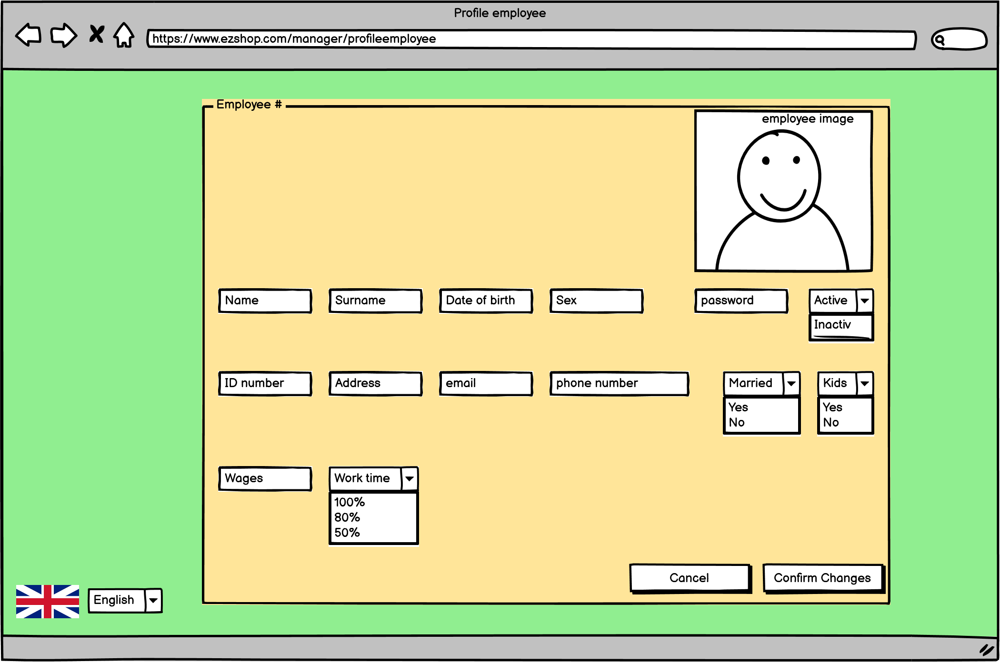
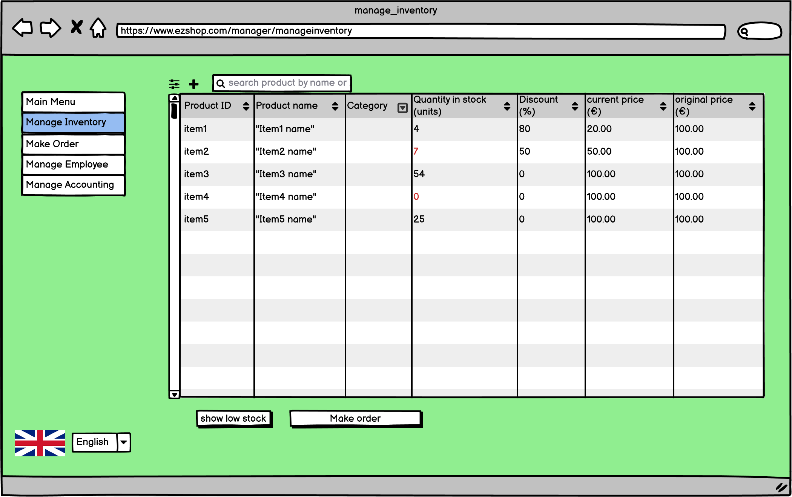
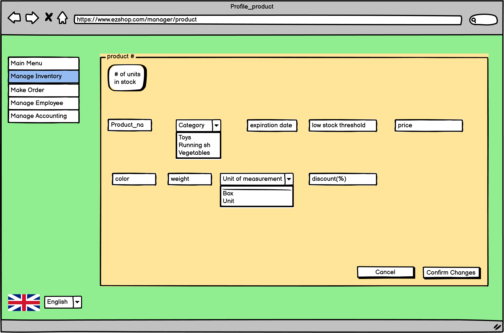
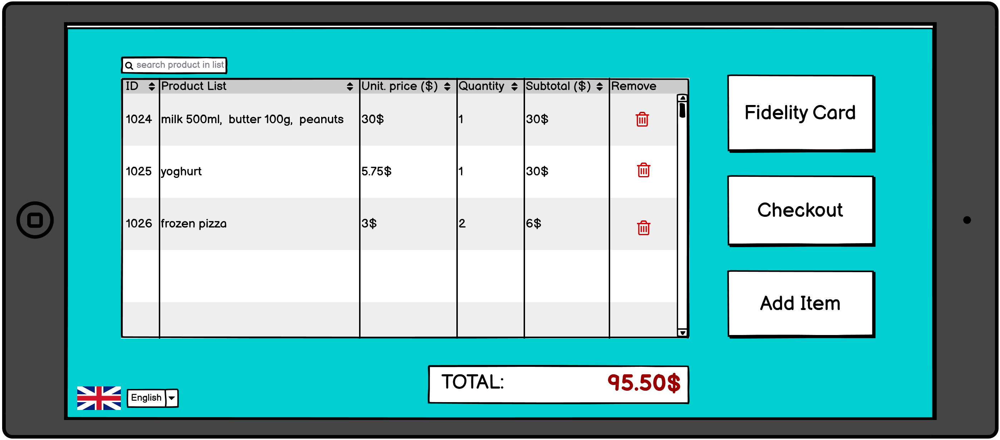
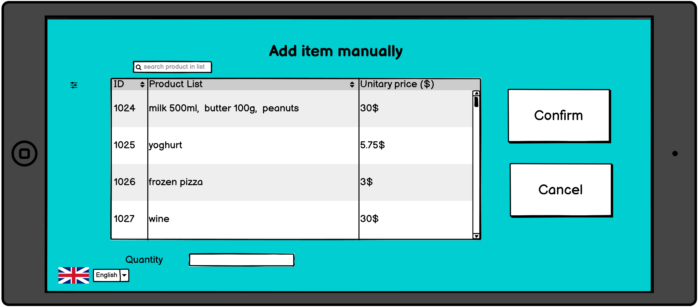
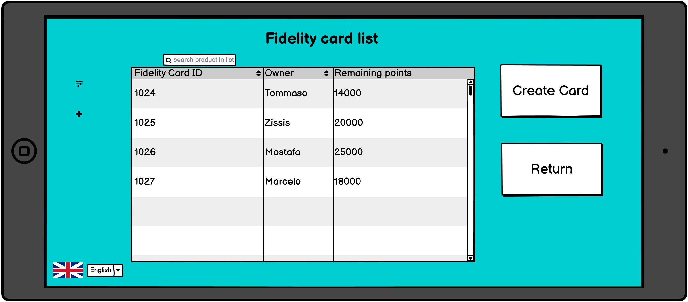
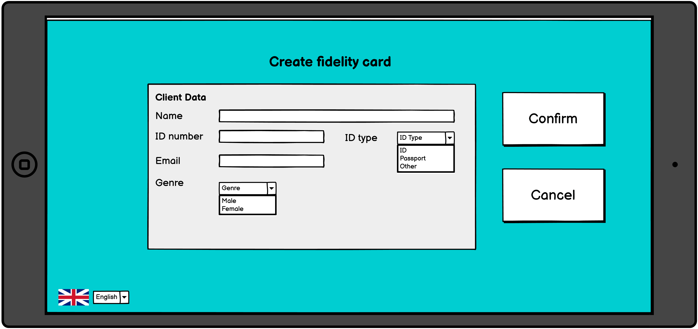
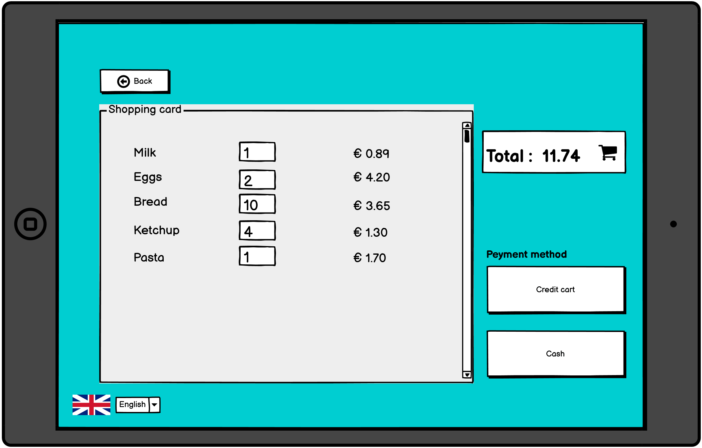

# Graphical User Interface Prototype  

Authors: Marcelo Coronel, Mostafa Asadollahy, Tommaso Natta, Zissis Tabouras 

Date: 21 april 2021

Version:

\<Report here the GUI that you propose. You are free to organize it as you prefer. A suggested presentation matches the Use cases and scenarios defined in the Requirement document. The GUI can be shown as a sequence of graphical files (jpg, png)  >

# Screenshots

## Screenshot 1

{info}

## Screenshot 2

{info}

## Screenshot 3

{info}

## Screenshot 4

{info}

## Screenshot 5

{info}

## Screenshot 6

This view is available only to the manager. It is shown when the manager selects from the vertical menu on the left the "manage employee" button.
From here the manager can:
1. <u><b>Add</b></u> a new <b>Salesperson</b>. This is done through the <b>"+"</b> button. This action will take us to "<b>Profile_employee</b>" view (screenshot 7).
2. <u><b>Update</b></u> the information related to an existing <b>Salesperson</b> by <b>"double clicking"</b> the desired entry in the table. This action will take us to <b>"Profile_employee"</b>(screenshot 7).
3. <u><b>Search</b></u> for a <b>Salesperson</b> by using the search bar. This action will make the content of the table to change real time. The search can happen by ID or Name.
4. <u><b>Change table preferencies</b></u> so that we can manage how many employees and what information about them will be displayed 
5. <u><b>Change to another view</b></u> from the left side menu. From there we can move directly to the <u><b>"Main menu"</b></u>(screenshot 2), <u><b>"Manage Inventory"</b></u>(screenshot 8), <u><b>"Make order"</b></u>(screenshot 4), <u><b>"Manage accounting"</b></u>(screenshot 3).

## Screenshot 7

This view is available only to the manager. It is shown when the manager selects to update or add an employee, which is available in the <b>"Manage employee"</b> view (screenshot 6). The creation of an emlpoyee will automatically assign an <b>ID number</b> to the entry which will be confirmed when changes are confirmed
From here the manager can:
1. <u><b>Update</b></u> the <b>details</b> of the selected <b>Salesperson</b>.
2. <u><b>Add</b></u>, set the initial information related to an new <b>Salesperson</b>.
3. <u><b>Confirm changes</b></u> made to the informations of the Salesperso and return to the <b>"Manage employee"</b> view (screenshot 6)
4. <u><b>Cancel changes</b></u> made to the informations of the Salesperson and return to the <b>"Manage employee"</b> view (screenshot 6)

## Screenshot 8

This view is available only to the manager. It is shown when the manager selects from the vertical menu on the left the "manage inventory" button. 
From here the manager can:
1. <u><b>Add</b></u> a new <b>Product</b> to the inventory. This is done through the <b>"+"</b> button. This action will take us to "<b>Product</b>"(screenshot 9).
2. <u><b>Update</b></u> the information related to an existing <b>product</b> by <b>"double clicking"</b> the desired entry in the table. This action will take us to <b>"Product"</b> view (screenshot 9).
3. <u><b>Search</b></u> for a <b>product</b> by using the search bar. This action will make the content of the table to change real time. The search can happen by ID or product name.
4. <u><b>Change table preferencies</b></u> so that the manager can manage how many products and what information will be displayed. This is done by clicking to the icon on the top left of the table near the "+" icon. 
5. <u><b>Show out-of-stock, or soon to be out-of-stock, products</b></u>. This is done by clicking on the <b>"show low stock"</b> button which will update the table with only the products that have a "red" quantity. The red quantity indicates that the stock of that product is below a certain threshold that is defined by the manager.
6. <u><b>Make Order</b></u> so that the manager can start a make order procedure to restock products that need restock. This action will take us to the <b>"make order"</b> view(screenshot 4) to define the order. 
7. <u><b>Change to another view</b></u> from the left side menu. From there we can move directly to the <u><b>"Main menu"</b></u>(screenshot 2), <u><b>"Manage Inventory"</b></u>(screenshot 8), <u><b>"Make order"</b></u>(screenshot 4), <u><b>"Manage accounting"</b></u>(screenshot 3).

## Screenshot 9

This view is available only to the manager. It is shown when the manager selects to update or add a product, which is available in the <b>"Manage inventory"</b> view (screenshot 8). The creation of a new product will automatically assign an <b>ID number</b> to the entry which will be confirmed when changes are confirmed
From here the manager can:
1. <u><b>Update</b></u> the <b>details</b> of the selected <b>Product</b>.
2. <u><b>Add</b></u>, set the initial information related to an new <b>Product</b>.
3. <u><b>Confirm changes</b></u> made to the details of the product and return to the <b>"Manage inventory"</b> view (screenshot 8)
4. <u><b>Cancel changes</b></u> made to the details of the product and return to the <b>"Manage inventory"</b> view (screenshot 8)

## Screenshot 10

{info}

## Screenshot 11

{info}

## Screenshot 12

{info}

## Screenshot 13

{info}

## Screenshot 14

{info}

## Screenshot 15

{info}

# Example of the GUI in the web interface

# Example of the GUI in a POS environment
