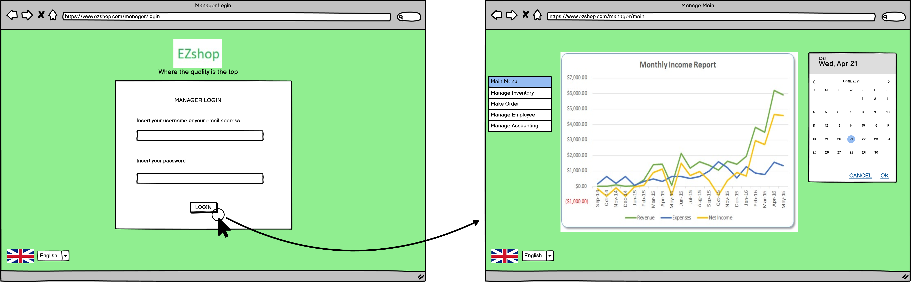
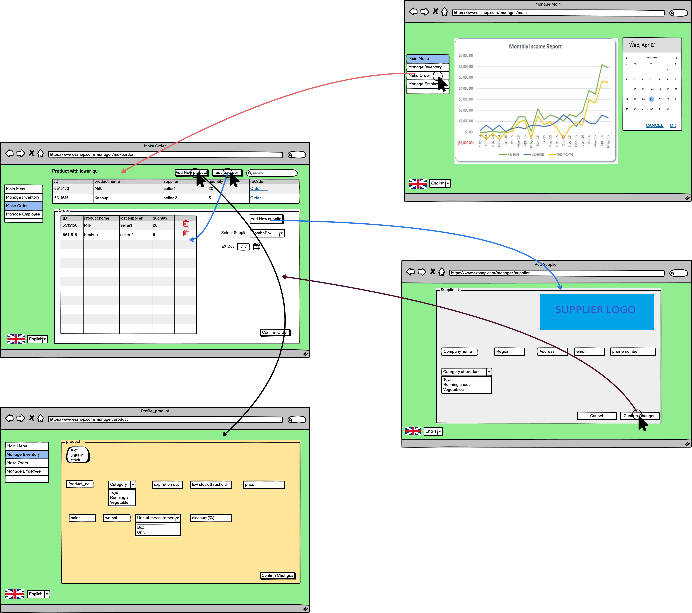
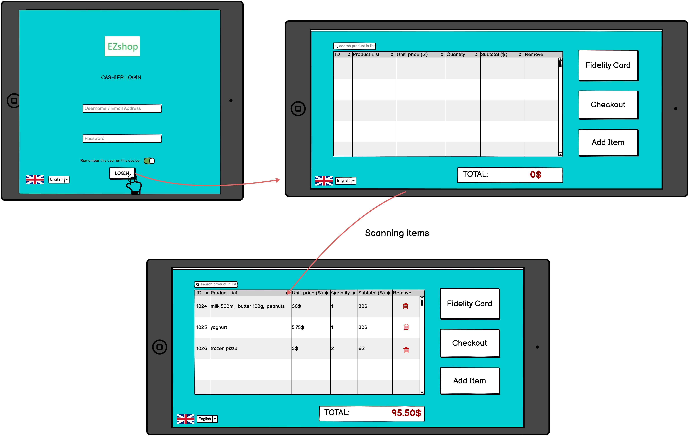

# Graphical User Interface Prototype  

Authors: Marcelo Coronel, Mostafa Asadollahy, Tommaso Natta, Zissis Tabouras 

Date: 21 april 2021

Version: #1

# Screenshots

## Screenshot 1

This view is available only to the manager. It is the first page shown. If the manager tries to connect to any other page without having an active session he is redirected here for the login.

1. A <u><b>form</b></u> asks the manager for his account username and password
2. The login <u><b>button</b></u> is pressed to login with the inserted credentials
3. A <u><b>dropdown menu</b></u> on the bottom left allows the user to change the language.

## Screenshot 2

This view is available only to the manager. It is shown right after the login.

1. A <u><b>menu</b></u> on the right allows the user to navigate through the available sections. 
2. A <u><b>chart</b></u> initially shows the current finantial situation of the shop
3. A <u><b>calendar</b></u> on the right can be used to select another period of time and update the chart accordingly

## Screenshot 3

This view is available only to the manager. It is shown when the manager selects from the vertical menu on the left the "manage accounting" button.

1. A <u><b>data grid</b></u> shows invoices. elements of the grid can be reordered by means of the arrow buttons and filtered by means of the <u><b>search bar</b></u>, where one can look for an ID, and the <u><b>date inputs</b></u>. The Status section indicates if the invoice was a mistake, and therefore was listed by the cashier as "to be void".
2. A <u><b>print button</b></u> prints to pdf the shown list of invoices, 
3. A <u><b>send email</b></u> button allows the manager to send that same pdf via email(see workflow "Manager send/print accounting report") 
4. A <u><b>void receipt button</b></u> allows the manager to void a receipt in the "to be void" state.

## Screenshot 4 - Make order

This view is available only to the manager. It is shown when the manager selects from the vertical menu on the left the "make order" button.

1. A <u><b>data grid</b></u> at the top of page show products, Items with fewer quantity have more priority.
    for making order easier manager can also click on <u><b>reorder</b></u> link to order previous order again.
2. In box of <u><b>order</b></u> you can see the list of selected order and also <u><b>changing supplier</b></u> is          possible there is also a link for <u><b>adding new supplier</b></u>.
3. Whenever order compeleted you can click on <u><b>confirm order</b></u>.

## Screenshot 5 - Add/Update supplier

This view is available only to the manager. It is shown when the manager selects to "Add new supplier", which is available in the "Make Order" view (screenshot 4). 

1. <u><b>Update</b></u> the <b>details</b> of the selected <b>Supplier</b>.
2. <u><b>Add</b></u>, set the initial information related to an new <b>Supplier</b>.
3. <u><b>Confirm changes</b></u> made to the informations of the Supplier and return to the <b>"Make Order"</b> view (screenshot 4)
4. <u><b>Cancel changes</b></u> made to the informations of the Supplier and return to the <b>"Make Order"</b> view (screenshot 4)

## Screenshot 6

This view is available only to the manager. It is shown when the manager selects from the vertical menu on the left the "manage employee" button.
From here the manager can:
1. <u><b>Add</b></u> a new <b>Salesperson</b>. This is done through the <b>"+"</b> button. This action will take us to "<b>Profile_employee</b>" view (screenshot 7).
2. <u><b>Update</b></u> the information related to an existing <b>Salesperson</b> by <b>"double clicking"</b> the desired entry in the table. This action will take us to <b>"Profile_employee"</b>(screenshot 7).
3. <u><b>Search</b></u> for a <b>Salesperson</b> by using the search bar. This action will make the content of the table to change real time. The search can happen by ID or Name.
4. <u><b>Change table preferencies</b></u> so that we can manage how many employees and what information about them will be displayed 
5. <u><b>Change to another view</b></u> from the left side menu. From there we can move directly to the <u><b>"Main menu"</b></u>(screenshot 2), <u><b>"Manage Inventory"</b></u>(screenshot 8), <u><b>"Make order"</b></u>(screenshot 4), <u><b>"Manage accounting"</b></u>(screenshot 3).

## Screenshot 7

This view is available only to the manager. It is shown when the manager selects to update or add an employee, which is available in the <b>"Manage employee"</b> view (screenshot 6). The creation of an emlpoyee will automatically assign an <b>ID number</b> to the entry which will be confirmed when changes are confirmed
From here the manager can:
1. <u><b>Update</b></u> the <b>details</b> of the selected <b>Salesperson</b>.
2. <u><b>Add</b></u>, set the initial information related to an new <b>Salesperson</b>.
3. <u><b>Confirm changes</b></u> made to the informations of the Salesperso and return to the <b>"Manage employee"</b> view (screenshot 6)
4. <u><b>Cancel changes</b></u> made to the informations of the Salesperson and return to the <b>"Manage employee"</b> view (screenshot 6)

## Screenshot 8

This view is available only to the manager. It is shown when the manager selects from the vertical menu on the left the "manage inventory" button. 
From here the manager can:
1. <u><b>Add</b></u> a new <b>Product</b> to the inventory. This is done through the <b>"+"</b> button. This action will take us to "<b>Product</b>"(screenshot 9).
2. <u><b>Update</b></u> the information related to an existing <b>product</b> by <b>"double clicking"</b> the desired entry in the table. This action will take us to <b>"Product"</b> view (screenshot 9).
3. <u><b>Search</b></u> for a <b>product</b> by using the search bar. This action will make the content of the table to change real time. The search can happen by ID or product name.
4. <u><b>Change table preferencies</b></u> so that the manager can manage how many products and what information will be displayed. This is done by clicking to the icon on the top left of the table near the "+" icon. 
5. <u><b>Show out-of-stock, or soon to be out-of-stock, products</b></u>. This is done by clicking on the <b>"show low stock"</b> button which will update the table with only the products that have a "red" quantity. The red quantity indicates that the stock of that product is below a certain threshold that is defined by the manager.
6. <u><b>Make Order</b></u> so that the manager can start a make order procedure to restock products that need restock. This action will take us to the <b>"make order"</b> view(screenshot 4) to define the order. 
7. <u><b>Change to another view</b></u> from the left side menu. From there we can move directly to the <u><b>"Main menu"</b></u>(screenshot 2), <u><b>"Manage Inventory"</b></u>(screenshot 8), <u><b>"Make order"</b></u>(screenshot 4), <u><b>"Manage accounting"</b></u>(screenshot 3).

## Screenshot 9

This view is available only to the manager. It is shown when the manager selects to update or add a product, which is available in the <b>"Manage inventory"</b> view (screenshot 8). The creation of a new product will automatically assign an <b>ID number</b> to the entry which will be confirmed when changes are confirmed
From here the manager can:
1. <u><b>Update</b></u> the <b>details</b> of the selected <b>Product</b>.
2. <u><b>Add</b></u>, set the initial information related to an new <b>Product</b>.
3. <u><b>Confirm changes</b></u> made to the details of the product and return to the <b>"Manage inventory"</b> view (screenshot 8)
4. <u><b>Cancel changes</b></u> made to the details of the product and return to the <b>"Manage inventory"</b> view (screenshot 8)

## Screenshot 10

This is the entry point of the mobile application for the <b>sales person</b>.

1. A <u><b>form</b></u> asks the sails person for his account username and password
2. The login <u><b>button</b></u> is pressed to login with the inserted credentials
3. The <u><b>On/Off Switch</b></u> enables the automatic login at the next access of the application
4. A <u><b>dropdown menu</b></u> on the bottom left allows the user to change the language.

## Screenshot 11

This is the main view for the <b>sales person</b>. In this screen the sales person will be able to visualize the list of products that have been read already by the QR reader. <b>Every time the QR reader process a new product, this list will be updated.</b> This list shows the products, their identifiers, unitary prices, quantities and the subtotal for each product. Additionally, the total ammount is calculated as the sum of subtotals and displayed at the bottom. In case that the sales person wants to confirm that a product has already been registered by the QR reader, he/she can use the search field in the upper left area to search for the product.
Three action buttons are available in this screen:
1. <u><b>Fidelity Card</u>.-</b> In case the client has one fidelity card and wants to use it or, also, whether the client wants to get a new fidelity card.
2. <u><b>Checkout</u>.-</b> After all the client's products have been processed by the QR reader, this button takes the sales person to the checkout screen where the sales person will be able to select the payment method and perform the transaction.
3. <u><b>Add Item</u>.-</b> Allows the sales person to add one additional product manually, by inserting the code of this product. This option is used in case the QR reader can't read the code of the product.

## Screenshot 12

The sales person arrives at this screen after clicking on the "Add Item" button. This screen shows the list of products available on the store, so the sales person can click on the product manually to select it, after that the sales person can click on the confirm button. The store may have hundreds of products, so there is a search field in the upper left area. After writing the information of the product, the list on the screen will be updated, making it easier to select the desired product. Also, it is possible to select the quantity of the items to add through the bottom left field. If no quantity is specified, the default is one.
Two action buttons are present in this screen:
1. <u><b>Confirm</u>.-</b> Confirms the selection and adds the product to the client's list.
2. <u><b>Cancel</u>.-</b> Cancels the addition of the product and returns to the previous screen without making any changes.
 
## Screenshot 13

The sales person arrives at this screen after clicking on the "Fidelity Card" button. This screen shows the <b>list of fidelity cards</b> registered on the system and their respective owners. In case the client has a fidelity card, the sales person should search for the client's fidelity card using the search field located on the upper left corner and click on the the client's cards. If no card is found, this means that the client does not have a fidelity card, therefore if the client agrees then the sales person can create a fidelity card for him.
There are two action buttons pressent on this screen:
1. <u><b>Create Card</u>.-</b> This action takes the sales person to a new screen where it is possible to create a new fidelity card using the client's data.
2. <u><b>Return</u>.- </b> In case the client doesn't want to use a fidelity card or get one, the screen retuns to the main view of the sales person.

## Screenshot 14

This view is available to the sales person after clicking on the Create Card button. On this screen, the sales person can <b>introduce the client's information</b> and generate a new fidelity card in the system for him. The fields to fill are name, ID, ID type, email and genre. After that data has been introduced the sales person can proceed to click on the Confirm button. The client may change his mind in the process so there is a Cancel button available.
Two action buttons are available on this screen:
1. <u><b>Confirm</u>.-</b> This button confirms the creation of the fidelity card and automatically selects it for its use in the client's order.
2. <u><b>Cancel</u>.-</b> This button cancels the creation of the fidelity card and returns to the previous screen.

## Screenshot 15 - Checkout

This view is available to the cashier. It is shown when purchase has been completed and all items barcode scanned. It is shown when a cashier click on the button <b>"Checkout"</b> which is availbe in the view (screenshot 11).

1. <u><b>Back </b></u> button return you to the view  (screenshot 11) for <b>add</b> or <b>update</b> purchase list.
2. <b>Sopping card</b> it is a complete overview of all scanned items and total amount of money.
3. <u><b>Payment method</b></u> , customer can choose between two type of payment <b>cash</b> or <b>credit cart</b>.

# Storyboards

## Manager login

## Manager add/update salesperson

## Manager add/update product

## Manager send/print accounting report

## Manager create order list

## Salesperson login and start scanning

