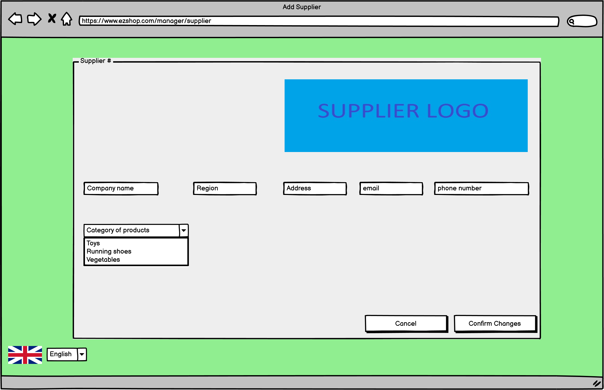

# Graphical User Interface Prototype  

Authors: Marcelo Coronel, Mostafa Asadollahy, Tommaso Natta, Zissis Tabouras 

Date: 21 april 2021

Version:

\<Report here the GUI that you propose. You are free to organize it as you prefer. A suggested presentation matches the Use cases and scenarios defined in the Requirement document. The GUI can be shown as a sequence of graphical files (jpg, png)  >

# Screenshots

## Screenshot 1

{info}

## Screenshot 2

{info}

## Screenshot 3

{info}

## Screenshot 4

{info}

## Screenshot 5

{info}

## Screenshot 6

This view is available onfly for the manager. It is shown when the manager selects from the vertical menu on the left the "manage employee" button.
From here the manager can:
1. <u><b>Add</b></u> a new <b>Salesperson</b>. This is done through the <b>"+"</b> button. This action will take us to "<b>Profile_employee</b>"(screenshot 8).
2. <u><b>Update</b></u> the information related to an existing <b>Salesperson</b> by <b>"double clicking"</b> the desired entry in the table. This action will take us to <b>"Profile_employee"</b>(screenshot 8).
3. <u><b>Search</b></u> for a <b>Salesperson</b> by using the search bar. This action will make the content of the table to change real time. The search can happen by ID or Name.
4. <u><b>Change to another view</b></u> from the left side menu. From there we can move directly to the <u><b>"Main menu"</b></u>(screenshot 2), <u><b>"Manage Inventory"</b></u>(screenshot 9), <u><b>"Make order"</b></u>(screenshot 4), <u><b>"Manage accounting"</b></u>(screenshot 3).

## Screenshot 7

{info}

## Screenshot 8

{info}

## Screenshot 9

{info}

## Screenshot 10

{info}

## Screenshot 11

{info}

## Screenshot 12

{info}

## Screenshot 13

{info}

## Screenshot 14

{info}

## Screenshot 15

{info}

