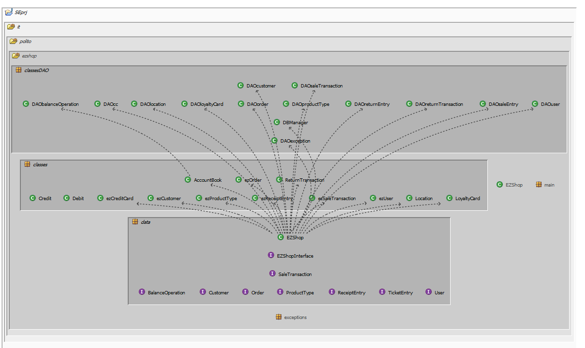

# Integration and API Test Documentation

Authors: Marcelo Coronel, Mostafa Asadollahy, Tommaso Natta, Zissis Tabouras 

Date: 27/05/2021

Version:

# Contents

- [Dependency graph](#dependency-graph)

- [Integration approach](#integration)

- [Tests](#tests)

- [Scenarios](#scenarios)

- [Coverage of scenarios and FR](#scenario-coverage)
- [Coverage of non-functional requirements](#nfr-coverage)

# Dependency graph 

     <report the here the dependency graph of the classes in EzShop, using plantuml>

​     
# Integration approach

    <Write here the integration sequence you adopted, in general terms (top down, bottom up, mixed) and as sequence
    (ex: step1: class A, step 2: class A+B, step 3: class A+B+C, etc)> 
    <Some steps may  correspond to unit testing (ex step1 in ex above), presented in other document UnitTestReport.md>
    <One step will  correspond to API testing>

#  Tests

   <define below a table for each integration step. For each integration step report the group of classes under test, and the names of
     JUnit test cases applied to them> JUnit test classes should be here src/test/java/it/polito/ezshop

     Approach : Bottom-up

## Step 1
| Classes  | JUnit test cases |
|--|--|
|DAObalanceOperation|TestDAObalanceOperation|
|DAOcustomer|TestDAOcustomer|
|DAOloyaltyCard|TestDAOloyaltyCard|
|DAOorder|TestDAOorder|
|DAOproductType|TestDAOproductType|
|DAOlocation|TestDAOlocation|
|DAOreturnEntry|testDAOReturnTransaction|
|DAOreturnTransaction|testDAOReturnTransaction|
|DAOsaleEntry|TestDAOsaleEntry|
|DAOsaleTransaction|TestDAOsaleTransaction|
|DAOuser||
|DAOcc||
|||

## Step 2
| Classes  | JUnit test cases |
|--|--|
|EzShop, DAObalanceOperation, AccountBook| testBalanceOperationApi|
|EzShop, DAOorder|testOrderApi|
|EzShop, DAOReturnTramsaction, DAOreturnEntry| testReturnTransactionApi|
|EzShop, DAOproductType, DAOlocation|TestProductTypeAPI|
|EzShop, DAOsaleTransaction, DAOproductType, DAOsaleEntry|TestSaleTransactionApi|

## Step n 

   

| Classes  | JUnit test cases |
|--|--|
|||

# Scenarios

<If needed, define here additional scenarios for the application. Scenarios should be named
 referring the UC in the OfficialRequirements that they detail>

##### Scenario 1-1

| Scenario |  Create product type X |
| ------------- |:-------------:|
|  Precondition     | User C exists and is logged in |
|  Post condition     | X  into the system and with an assigned location  |
| Step#        | Description  |
|  1    |  C inserts new product description |
|  2    |  C inserts new bar code |
|  3    |  C inserts new price per unit |
|  4    |  C inserts new product notes |
|  5    |  C enters location of X |
|  6    |  C confirms the entered data |

##### Scenario 1-2

| Scenario |  Modify product type location |
| ------------- |:-------------:|
|  Precondition     | Employee C exists and is logged in |
|  | Product type X exists |
|  | Location L is free |
|  Post condition     | X.location = L |
| Step#        | Description  |
|  1    |  C searches X via bar code |
|  2    |  C selects X's record |
|  3    |  C selects a new product location |

##### Scenario 1-3

| Scenario |  Modify product type price per unit |
| ------------- |:-------------:|
|  Precondition     | Employee C exists and is logged in |
|  | Product type X exists |
|  Post condition     | X.pricePerUnit = new Price |
| Step#        | Description  |
|  1    |  C searches X via bar code |
|  2    |  C selects X's record |
|  3    |  C inserts a new price > 0 |
|  4   |  C confirms the update |
|  5   |  X is updated |

##### Scenario 3-1

| Scenario |  Order of product type X issued |
| ------------- |:-------------:| 
|  Precondition     | ShopManager S exists and is logged in |
| | Product type X exists |
|  Post condition     | Order O exists and is in ISSUED state  |
| | Balance not changed |
| | X.units not changed |
| Step#        | Description  |
|  1    | S creates order O |
|  1    |  S fills  quantity of product to be ordered and the price per unit |  
|  3    |  O is recorded in the system in ISSUED state |

##### Scenario 3-2

| Scenario |  Order of product type X payed |
| ------------- |:-------------:| 
|  Precondition     | ShopManager S exists and is logged in |
| | Product type X exists |
| | Balance >= Order.units * Order.pricePerUnit |
| | Order O exists | 
|  Post condition     | Order O is in PAYED state  |
| | Balance -= Order.units * Order.pricePerUnit |
| | X.units not changed |
| Step#        | Description  |
|  1    |  S search for Order O |  
|  2    |  S register payment done for O |
|  3    |  O's state is updated to PAYED |

##### Scenario 3-3

| Scenario |  Record order of product type X arrival |
| ------------- |:-------------:| 
|  Precondition     | ShopManager S exists and is logged in |
| | Product type X exists |
| | X.location is valid |
| | Order O exists and is in PAYED state  |
|  Post condition     | O is in COMPLETED state  |
| | X.units += O.units |
| Step#        | Description  |
|  1    |  O arrives to the shop |  
|  2    |  S records O arrival in the system  |
|  3    |  The system updates X available quantity |
|  4    |  O is updated in the system in COMPLETED state |

##### Scenario 4-1

| Scenario |  Create customer record |
| ------------- |:-------------:|
|  Precondition     | Account U for Customer Cu not existing  |
|  Post condition     | U is  into the system  |
| Step#        | Description  |
|  1    |  User asks Cu personal data |
|  2    |  USer fills U's fields with Cu's personal data |
|  3    |  User confirms  |

**Scenario 4-2**

| Scenario |  Attach Loyalty card to customer record |
| ------------- |:-------------:|
|  Precondition     | Account U for Customer Cu existing  |
|  Post condition     | Loyalty card L attached to U |
| Step#        | Description  |
|  1    |  User creates a new L with a unique serial number |
|  2    |  User attaches L to U  |

##### Scenario 4-3

| Scenario |  Detach Loyalty card from customer record |
| ------------- |:-------------:|
|  Precondition     | Account U for Customer Cu existing  |
| | Loyalty card L attached to U |
|  Post condition     | Loyalty card L detached from U |
| Step#        | Description  |
|  1    |  User selects customer record U |
|  2    |  User  detaches L from U  |
|  3    |  U is updated |

##### Scenario 4-4

| Scenario |  Update customer record |
| ------------- |:-------------:|
|  Precondition     | Account U for Customer Cu existing  |
|  Post condition     | U updated |
| Step#        | Description  |
|  1    |  User selects customer record U |
|  2    |  User modifies personal data of Cu  |

##### Scenario 6-1 

| Scenario |  Sale of product type X completed |
| ------------- |:-------------:|
|  Precondition     | Cashier C exists and is logged in |
| | Product type X exists and has enough units to complete the sale |
|  Post condition     | Balance += N*X.unitPrice  |
| | X.quantity -= N |
| Step#        | Description  |
|  1    |  C starts a new sale transaction |
|  2    |  C reads bar code of X |
|  3    |  C adds N units of X to the sale |
|  4    |  X available quantity is decreased by N |
|  5    |  C closes the sale transaction |
|  6    |  System asks payment type |
|  7    |  Manage  payment (see UC7) |
|  8    |  Payment successful |
|  9   |  C confirms the sale and prints the sale Ticket |
|  10   |  Balance is updated |

##### Scenario 6-2

| Scenario |  Sale of product type X with product discount |
| ------------- |:-------------:|
|  Precondition     | Cashier C exists and is logged in |
| | Product type X exists and has enough units to complete the sale |
|  Post condition     | Balance += (N*X.unitPrice - N*X.unitPrice*ProductDiscount)  |
| | X.quantity -= N |
| Step#        | Description  |
|  1    |  C starts a new sale transaction |
|  2    |  C reads bar code of X |
|  3    |  C adds N units of X to the sale |
|  4    |  X available quantity is decreased by N |
|  5    |  C applies a discount rate for X |
|  6    |  C closes the sale transaction |
|  7    |  Sytem ask payment type |
|  8    |  Manage  payment (go to UC 7) |
|  9   |  Payment successful |
|  10   |  C confirms the sale and prints the sale Ticket |
|  11   |  Balance is updated |

##### Scenario 6-3

| Scenario |  Sale of product type X with sale discount |
| ------------- |:-------------:|
|  Precondition     | Cashier C exists and is logged in |
| | Product type X exists and has enough units to complete the sale |
|  Post condition     | Balance += (N*X.unitPrice) - N*X.unitPrice*SaleDiscount)  |
| | X.quantity -= N |
| Step#        | Description  |
|  1    |  C starts a new sale transaction |
|  2    |  C reads bar code of X |
|  3    |  C adds N units of X to the sale |
|  4    |  X available quantity is decreased by N |
|  5    |  C applies a sale discount rate |
|  6    |  C closes the sale transaction |
|  7    |  Sytem ask payment type |
|  8    |  Manage  payment (go to UC 7 ) |
|  9    |  Payment successful |
|  10   |  C confirms the sale and prints the sale Ticket |
|  11   |  Balance is updated |

##### Scenario 6-4

| Scenario |  Sale of product type X with Loyalty Card update |
| ------------- |:-------------:|
|  Precondition     | Cashier C exists and is logged in |
| | Product type X exists and has enough units to complete the sale |
| | Customer Cu has a Loyalty Card L |
|  Post condition     | Balance += N*X.unitPrice  |
| | X.quantity -= N |
| | L.points += (N*X.unitPrice)/10 |
| Step#        | Description  |
|  1    |  C starts a new sale transaction |
|  2    |  C reads bar code of X |
|  3    |  C adds N units of X to the sale |
|  4    |  X available quantity is decreased by N |
|  5    |  C closes the sale transaction |
|  6    |  Sytem ask payment type |
|  7    |  C reads L serial number |
|  8    |  Manage credit card payment (go to scenario 3) |
|  9   |  Payment successful |
|  10   |  L.points updated |
|  11   |  C confirms the sale and prints the sale Ticket |
|  12   |  Balance is updated |

##### Scenario 6-5

| Scenario |  Sale of product type X cancelled |
| ------------- |:-------------:|
|  Precondition     | Cashier C exists and is logged in |
| | Product type X exists and has enough units to complete the sale |
|  Post condition     | Balance not changed  |
| | X.quantity not changed |
| Step#        | Description  |
|  1    |  C starts a new sale transaction |
|  2    |  C reads bar code of X |
|  3    |  C adds N units of X to the sale |
|  4    |  X available quantity is decreased by N |
|  5    |  C closes the sale transaction |
|  6    |  System ask payment type |
|  7    |  Customer cancels the payment |
|  8    |  Sale transaction aborted |
|  9   |  Sale ticket deleted, no change will be recorded |

##### Scenario 8-1

| Scenario |  Return transaction of product type X completed, credit card |
| ------------- |:-------------:| 
|  Precondition     | Cashier C exists and is logged in |
| | Product Type X exists |
| | Ticket T exists and has at least N units of X |
| | Ticket T was paid with credit card |
|  Post condition     | Balance -= N*T.priceForProductX  |
| | X.quantity += N |
| Step#        | Description  |
|  1    |  C inserts T.ticketNumber |
|  2    |  Return transaction starts |  
|  3    |  C reads bar code of X |
|  4    |  C adds N units of X to the return transaction |
|  5    |  X available quantity is increased by N |
|  6    |  Manage credit card return  (go to UC 10 ) |
|  7   |  Return successful, C closes the return transaction |
|  8   |  Balance is updated |

##### Scenario 8-2

| Scenario |  Return transaction of product type X completed, cash |
| ------------- |:-------------:| 
|  Precondition     | Cashier C exists and is logged in |
| | Product Type X exists |
| | Ticket T exists and has at least N units of X |
| | Ticket T was paid cash |
|  Post condition     | Balance -= N*T.priceForProductX  |
| | X.quantity += N |
| Step#        | Description  |
|  1    |  C inserts T.ticketNumber |
|  2    |  Return transaction starts |  
|  3    |  C reads bar code of X |
|  4    |  C adds N units of X to the return transaction |
|  5    |  X available quantity is increased by N |
|  6    |  Manage cash return (go to UC 10) |
|  7   |  Return  successful |
|  8   |  C confirms the return transaction and closes it  |
|  9   |  Sale Ticket is updated |
|  10   |  Balance is updated |

##### Scenario 9-1

| Scenario |  List credits and debits |
| ------------- |:-------------:| 
|  Precondition     | Manager C exists and is logged in |
|  Post condition     | Transactions list displayed  |
| Step#        | Description  |
|  1    |  C selects a start date |  
|  2    |  C selects an end date |
|  3    |  C sends transaction list request to the system |
|  4    |  The system returns the transactions list |
|  5    |  The list is displayed  |

# Coverage of Scenarios and FR

<Report in the following table the coverage of  scenarios (from official requirements and from above) vs FR. 
Report also for each of the scenarios the (one or more) API JUnit tests that cover it. >

FR completed: FR4, FR8

| Scenario ID | Functional Requirements covered | JUnit  Test(s) |
| ----------- | ------------------------------- | ----------- |
|  1.1     | FR 3.1                        | TestProductTypeAPI |
|  1.2      | FR 4.2                        | TestProductTypeAPI |
| 1.3         | FR 3.1                          | TestProductTypeAPI          |
| 3.1         | FR 4.3, FR 4.5   , FR 4.7       | testOrderApi          |
| 3.2         | FR 4.4 , FR 4.2                 | testOrderApi          |
| 3.3         | FR 4.6 , FR 4.1                 | testOrderApi          |
| 4.1      | FR 5.1 | TestCustomerApi |
| 4.2      | FR 5.6 |             |
| 4.3 |  | |
| 4.4       | FR 5.1 | TestCustomerApi |
| 6.1 | FR 6.1, FR 6.2, FR 6.10 | TestSaleTransactionApi |
| 6.2 | FR 6.1, FR 6.2, FR 6.5, FR 6.10 | TestSaleTransactionApi |
| 6.3 | FR 6.1, FR 6.2, FR 6.6, FR 6.10 | TestSaleTransactionApi |
| 6.4 | FR 5.7, FR 6.1, FR 6.2, FR 6.10 | TestSaleTransactionApi, ... |
| 6.5 | FR 6.1, FR 6.2, FR 6.10, FR6.11, FR8.2 | TestSaleTransactionApi, testBalanceOperationApi... |
| 8.1 | FR 6.12, FR 6.13, FR 6.14, FR6.15, FR8.1 | testReturnTransactionApi, testBalanceOperationApi |
| 8.2 | FR 6.7, FR 6.8, FR 6.9, FR 6.12, FR 6.13, FR 6.14, FR6.15 | testReturnTransactionApi |
| 9.1 | FR 8.3, FR 8.4 | testBalanceOperationApi |
|  | | |
|  | | |
|  | | |

# Coverage of Non Functional Requirements

<Report in the following table the coverage of the Non Functional Requirements of the application - only those that can be tested with automated testing frameworks.>

### 

| Non Functional Requirement | Test name |
| -------------------------- | --------- |
|                            |           |

