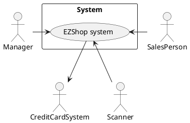
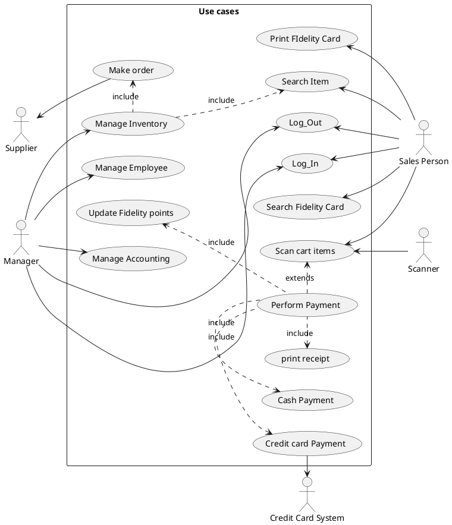
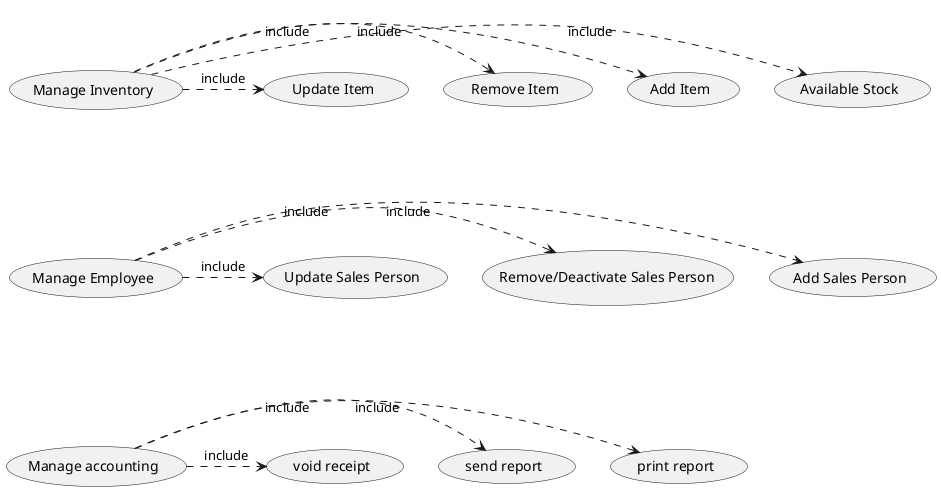
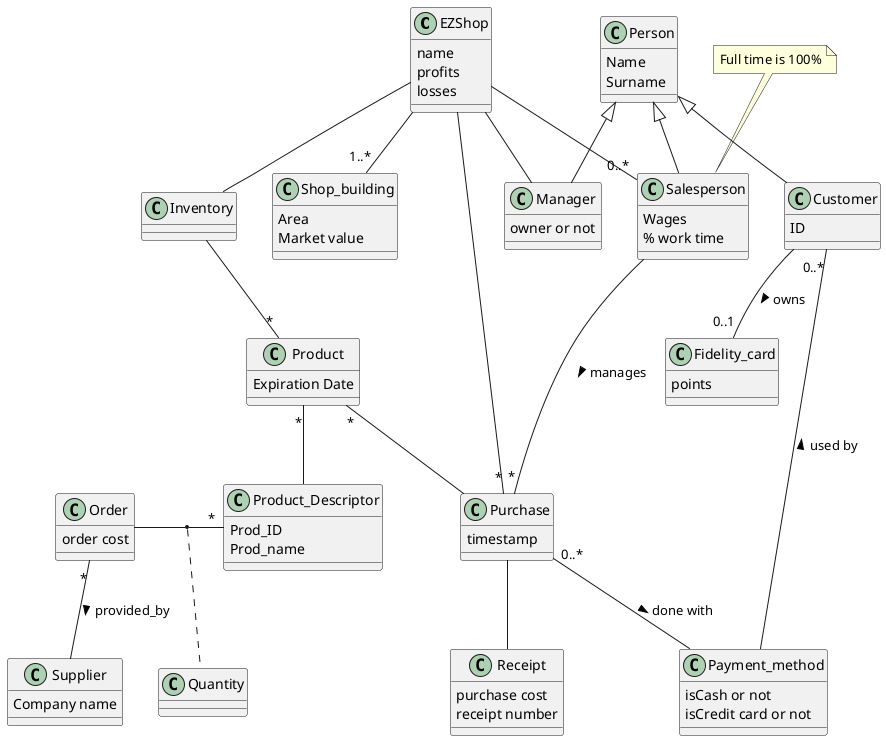

# Requirements Document 

Authors: Marcelo Coronel, Mostafa Asadollahy, Tommaso Natta, Zissis Tabouras

Date:

Version:

# Contents

- [Essential description](#essential-description)
- [Stakeholders](#stakeholders)
- [Context Diagram and interfaces](#context-diagram-and-interfaces)
	+ [Context Diagram](#context-diagram)
	+ [Interfaces](#interfaces) 
	
- [Stories and personas](#stories-and-personas)
- [Functional and non functional requirements](#functional-and-non-functional-requirements)
	+ [Functional Requirements](#functional-requirements)
	+ [Non functional requirements](#non-functional-requirements)
- [Use case diagram and use cases](#use-case-diagram-and-use-cases)
	+ [Use case diagram](#use-case-diagram)
	+ [Use cases](#use-cases)
    	+ [Relevant scenarios](#relevant-scenarios)
- [Glossary](#glossary)
- [System design](#system-design)
- [Deployment diagram](#deployment-diagram)

# Essential description

Small shops require a simple application to support the owner or manager. A small shop (ex a food shop) occupies 50-200 square meters, sells 500-2000 different item types, has one or a few cash registers 
EZShop is a software application to:
* manage sales
* manage inventory
* manage customers
* support accounting


# Stakeholders


| Stakeholder name  | Description | 
| ----------------- |:-----------:|
|      Manager             |  Manages the employees and he is responsible for managing the inventory stock  | 
| Salesperson | He/She is the person who confirms the purchases made by the client|
| Client | Accesses the shop to get necessary items and pay for them |
| Supplier | Manages and receives the order made by the manager |
| maintenance | Offers technical support in case of mulfunction of the system |
| Credit card system| Manages the payment when the client pays thought a credit card|

# Context Diagram and interfaces

## Context Diagram





## Interfaces

| Actor | Logical Interface | Physical Interface  |
| ------------- |:-------------|:-----|
| Manager | Application GUI | Screen keyboard on PC  |
| SalesPerson | Aplpicarion GUI | Touch screen on POS|
| Credit Card System| Payment gateway API | Dedicated console |
| Scanner | Scanner API | Scanning device |
# Stories and personas

The following personas and stories are meant to cover different profiles of the Salesperson

Rebecca is 35, works as a sales person. She has a child and she is not married. When going to work she doesn't need to have more problems due to the software she will have to use during that time. She doesn't care about advanced or complicated operations and wants to perform what is necessary fast and without any problems and the least interaction with the clients as possible. 

David is 62, works at the counter of a shop and has two children and one grandchild. He doesn't like technology and the most high tech device in his home is the TV and an old PC. He doesn't have a smartphone or use email by choice. If it was for him he would use an old cash register instead of computer. 

Elena is 20, and is a student at the Polytechnic of Turin. She is single and works part time to pay for daily expenses. She is very familira with technology and has no problem with exploring new technology and services.

Emma is 36, and works as at the counter. She is not married and leaves alone with her five cats. She is very active against animal cruelty and mistreatment. She is very social and likes to interact with clients and have a quick chat while performing her job.


# Functional and non functional requirements

## Functional Requirements


| ID        | Description  |
| ------------- |:-------------|
|FR 1| Manage Sales|
|FR 1.1| Manage prices
|FR 1.1.1| Increase/decrease price of a product.
|FR 1.1.2| Increase/decrease price of category.
|FR 1.1.3| Increase/decrease price of given rate.
|FR 1.2| Manage offers
|FR 1.2.1| Create/delete new offers
|FR 1.2.2| Assign/remove offer from product
|FR 1.2.3| Modify offer
|FR 1.3| Manage payment method
|FR 1.3.1| Add/remove payment method
|FR 1.3.2| Add/remove accepted cards (visa, mastercard, etc)
|FR 1.4| Manage cash register
|FR 1.4.1| Create/delete cash register
|FR 1.4.2| Enable/disable cash register
|FR 1.5| Manage employee
|FR 1.5.1| Add/remove employee
|FR 1.5.2| Create/delete employee credentials 
|FR 1.6| Generate receipt
|FR 1.7| Void receipt
|FR 2| Manage Inventory
|FR 2.1| Manage product categories
|FR 2.1.1| Create/delete product categories
|FR 2.1.2| Assign/remove products from categories
|FR 2.1.3| Modify product category
|FR 2.2| Manage stock
|FR 2.2.1| Display stock of products|
|FR 2.2.2| Increase/decrease stock automatically after sale or voiding receipt|
|FR 2.2.3| Manage low stock|
|FR 2.2.3.1| Set alert for low stock|
|FR 2.2.3.2| Send notification when low stock is reached|
|FR 2.2.4| Set/unset "in stock" flag|
|FR 2.3| Manage restock|
|FR 2.3.1| Create/remove order|
|FR 2.3.2| Modify order|
|FR 2.3.3| Perform order via mail|
|FR 3| Manage customer with fidelity card|
|FR 3.1| Manage a single customer|
|FR 3.1.1|Add/remove customer|
|FR 3.1.2|Modify customer data|
|FR 3.2|Manage customer classification|
|FR 3.2.1|Create/remove customer classification|
|FR 3.2.2|Modify customer classification|
|FR 3.3|Manage customer mailing list|
|FR 3.3.1|Send email|
|FR 3.3.2|Assign/remove promotion to customer|
|FR 3.3.3|Subscribe/unsubscribe customers from mailing.|
|FR 3.4|Manage fidelity cards|
|FR 3.4.1|Create/delete fidelity card|
|FR 3.4.2|Assign/remove fidelity card to customer|
|FR 4|Support Accounting|
|FR 4.1|Reporting sales|
|FR 4.1.1|Report daily, weekly, monthly, yearly.|
|FR 4.1.2|Report sales between given dates (from date1 - to date2)|
|FR 4.1.3|Format report to csv or txt|
|FR 4.2|Electronic invoicing (with suppliers)|
|FR 4.2.1|Create electronic invoice|
|FR 4.2.2|Print electronic invoice|
|FR 4.2.3|Cancel electronic invoice|
|FR 4.2.4|Assign supplier order to electronic invoice|
|FR 4.3|Electronic billing (with customers)|
|FR 4.3.1|Create electronic bill|
|FR 4.3.2|Print electronic bill|
|FR 4.3.3|Cancel electronic bill|
|FR 4.3.4|Assign customer order to electronic bill|


### Access right, actor vs function

| Function | Manager | Sales Person | 
| ------------- |:-------------|--|
| FR 1| yes | no |
| FR 1.6| yes | yes|
| FR 2| yes | no |
| FR 1.3| yes | no |
| FR 3 | yes | yes |
| FR 4 | yes | no |
| FR 4.3| yes | yes |

## Non Functional Requirements
| ID        | Type        | Description  | Refers to |
| ------------- |:-------------:| :-----| -----:|
|  NFR1     | Usability | No training required for the use of the application | All FR |
|  NFR2     | Performance | All operations should complete in less than 1 sec | All FR |
|  NFR3     | Portability | HTML5 compatibility. Must support Chrome and Firefox in OS Windows 7+, Unix and Android 6+. | All FR |
|  NFR4     | Privacy     | The data of the management of the store should be private and disclosed. | All FR |
|  NFR5     | Localisation | Decimal numbers use . (dot) as decimal separator  | All FR, notably FR4|


# Use case diagram and use cases


## Use case diagram






## Use cases

### Use case 1, UC1 - Update Item

| Actors Involved        | Manager|
| ------------- |:-------------:|
|  Precondition     	| Item exists in Inventory |
|  Post condition     	| Item's details are updated |
|  Nominal Scenario     | An item has wrong or old info and must be updated  |
|  Variants     		|  |


### Use case 2, UC2 - Remove Item

| Actors Involved       |   Manager|
| ------------- |:-------------:|
|  Precondition     	| Item exists in Iventory |
|  Post condition    	| Item does not exist in Inventory |
|  Nominal Scenario     | Item is not sold anymore and must be removed from the Inventory |
|  Variants     		| |

### Use case 3, UC3 - Add Item

| Actors Involved       |  Manager |
| ------------- |:-------------:|
|  Precondition     	| Item does not exist in Inventory |
|  Post condition     	| Item exists in Iventory |
|  Nominal Scenario   	| Manager add an item that previously was not availably to be sold |
|  Variants     		| User U can delete only his / her account. Administrator can delete any account |


### Use case 4, UC4 - Available Stock

| Actors Involved       | Manager |
| ------------- |:-------------:|
|  Precondition     	| The inventory exists |
|  Post condition     	| The manager knows the items in stock and out of stock |
|  Nominal Scenario     | The manager needs to know the stock availability of the items in the inventory. He gets and indication of all the items in stock and what is their availability |


### Use case 5, UC5 - Update Sales Person

| Actors Involved       | Manager |
| ------------- |:-------------:|
|  Precondition     	| Sales Person exists |
|  Post condition     	| Sales Person's details are added or updated |
|  Nominal Scenario     | The sales person personal information has changed and must be updated |
|  Variants     		| The sales person exists but he/she is deactivated, the manager can re-activate the account|


### Use case 6, UC6 - Deactivate Sales Person

| Actors Involved  |                        Manager          |
| ---------------- | :----------------------------------------------------------: |
| Precondition     | Sales Person does have an account on his/her name |
| Post condition   | Sales Person account is suspended but still present in the system |
| Nominal Scenario | The manager has fired an employee; The employee left the business |
| Variants         | - |


### Use case 7, UC7 - Add Sales Person

| Actors Involved  |                   Manager                    |
| ---------------- | :----------------------------------------------------------: |
| Precondition     | Sales person does not exist |
| Post condition   | The sales person has an account |
|                  | The sales person can log in |
| Nominal Scenario | The business hires a new employee |
| Variants         | - |


### Use case 8, UC8 - Make Order

| Actors Involved  |          Manager                      |
| ---------------- | :----------------------------------------------------------: |
| Precondition     	| The remaining stock of at least one item is deemed too low |
| Post condition    | The order is placed |
|					| The order has been sent to the supplier |
|					| The supplier has been payed for the order |
| Nominal Scenario 	| The manager checked the stock availability and believes that a restock is necessary. The manager creates and order, choses a payment option and the order is sent to the supplier |
| Variants          | - |


### Use case 9, UC9 - Log In
| Actors Involved  |                    Sales Person                 |
| ---------------- | :----------------------------------------------------------: |
| Precondition     	| The sales person account has been added by the manager |
| Post condition   	| The sales person acessed his personal account |
| Nominal Scenario 	| The sales person starts his/her shift, accesses account on which transactions will be registered |
| Variants 			| Sales person can log-in only on his/her account|
|					| Sales person lost/forgot his/her password, The Manager can unlock the account by updating sales person|	


### Use case 10, UC10 - Log Out

| Actors Involved  |         Sales Person                         |
| ---------------- | :----------------------------------------------------------: |
| Precondition     	| Sales person is logged-in in his/her account |
| Post condition   	| Sales person is logged-out of his/her account |
| Nominal Scenario 	| The sales person has completed his/her shift and has to log-out |
| Variants          | The sales person can log-out only from his/her account |
|					| The sales person forgot to log-out, The manager performs the log-out bu using manager-key |


### Use case 11, UC11 - Scan Cart Items

| Actors Involved  |         Sales Person                         |
| ---------------- | :----------------------------------------------------------: |
| Precondition     	| The client brought to the cashier the items he/she wants to buy |
|					| The cashier is logged-in |
| Post condition   	| Cart items have been scanned |
|					| The total cost of the items is available |
| Nominal Scenario 	| The client has collected all items of interest, gives them to the cashier, the cashiers scans them and inform the client of the price of his/her purchase |
| Variants          | The client does not want to conclude the purchase, the cashier cancel the scanned items |


### Use case 12, UC12 - Perform Payment

| Actors Involved  |         Sales Person                         |
| ---------------- | :----------------------------------------------------------: |
| Precondition     	| The cashier has scanned the items brought by the client |
|					| The client has chosen a payment method |
| Post condition   	| The payment for the cart items has been completed |
|					| Fidelity card points updated |
|					| The system has printed a receipt|
| Nominal Scenario 	| The cashier informs the client of the price, the client informs the cashier of the payment method, the client pays for his purchase, client receives the receipt|
| Variants          | The client's credit card payment option is rejected, chooses a different payment method |
|					| The client does not have the required amount of money or does not want to go through with the payment, the cashier cancels the cart items|

### Use case 13, UC13 - Search Fidelity Card

| Actors Involved  |         Sales Person                         |
| ---------------- | :----------------------------------------------------------: |
| Precondition     	| Fidelity card for client does exists |
| Post condition   	| Client of fidelity card found |
| Nominal Scenario 	| The cashier inputs the clients name or fidelity card number and gets the clients profile with fidelity points|
| Variants          | - |

### Use case 14, UC14 - Print Fidelity Card

| Actors Involved  |         Sales Person                         |
| ---------------- | :----------------------------------------------------------: |
| Precondition     	| Fidelity card for client does not exist |
| Post condition   	| Fidelity card for the client has been created |
| Nominal Scenario 	| The client asks for the fidelity card, the cashier checks that the client does not have one, the cashier prints a fidelity card|
| Variants          | - |

#### Relevant scenarios


##### Scenario 1.1 

| Scenario |  Update Item through list |
| ------------- |:-------------:| 
|  Precondition     | Item is present in inventory |
|  Post condition     | Item has new details |
|  Step#        | Description  |
|  1    |  Manager prints on screen the list of items in the inventory |
|  2    |  Manager selects the item to be updated |
|  3	|  Manager updates item |
|  4    |  Manager saves changes |

##### Scenario 1.2

| Scenario |  Update Item through item search |
| ------------- |:-------------:| 
|  Precondition     | Item is present in inventory |
|  Post condition     | Item has new details |
|  Step#        | Description  |
|  1    |  Manager inputs items ID in search space |
|  2    |  The system return the item profile |
|  3	|  Manager updates item |
|  4    |  Manager saves changes |


##### Scenario 3.1 

| Scenario |  Add item in inventory |
| ------------- |:-------------:| 
|  Precondition     | Item is not present in inventory |
|  Post condition     | New item is in inventory |
|  Step#        | Description  |
|  1    |  Manager selects "add item" button |
|  2    |  System shows to manager the fields to fill |
|  3	|  Manager inserts item details |
|  4    |  Manager saves changes |


##### Scenario 8.1 

| Scenario |  Order made to restock inventory |
| ------------- |:-------------:| 
|  Precondition     | One or more items in the inventory need restock |
|  Post condition     | The supplier is informed of the order |
|  Step#        | Description  |
|  1    |  Manager chooses "make order" in in the system  |
|  2    |  System shows to manager empty list order |
|  3	|  Manager inserts items to order |
|  4    |  Manager chooses the Supplier to whom to send the order |
|  5	|  Manager chooses payment option|
|  6    |  Manager confirms order |


##### Scenario 12.1 

| Scenario |  pay with credit card |
| ------------- |:-------------:| 
|  Precondition     | Cashier has scanned the items in the shopping cart of the client |
|  Post condition     | Client payed for his/hers purchase with credit card |
|  Step#        | Description  |
|  1    |  Client chooses to pay with credit card|
|  2    |  Cashier informs the system |
|  3	|  Client reaches credit card reader device with his/hers credit card and inserts credentials|
|  4    |  The system gets the commit of the transaction from the credit card system |
|  5    |  Receipt is printed |

##### Scenario 12.2 
| Scenario |  pay with cash |
| ------------- |:-------------:| 
|  Precondition     | Cashier has scanned the items in the shopping cart of the client |
|  Post condition     | Client payed for his/hers purchase in cash  |
|  Step#        | Description  | 
|  1    |  Client chooses to pay with cash|
|  2    |  Cashier informs the system |
|  3	|  Cashier receives money from client|
|  4    |  The system gets the commit of the transaction by the cashier|
|  5    |  Receipt is printed |

# Glossary


# System Design

Not really meaningful in this case.  Only software components are needed.

# Deployment Diagram 

Client server model. The application runs on a server or virtual machine, any client accesses it through PC or POS.

```plantuml
artifact "EZShop Application" as ezshop
node "server" as s
node "POS" as pc
s -- ezshop
s -- "*" pc
```

