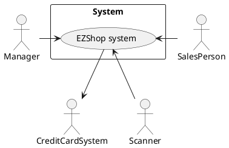
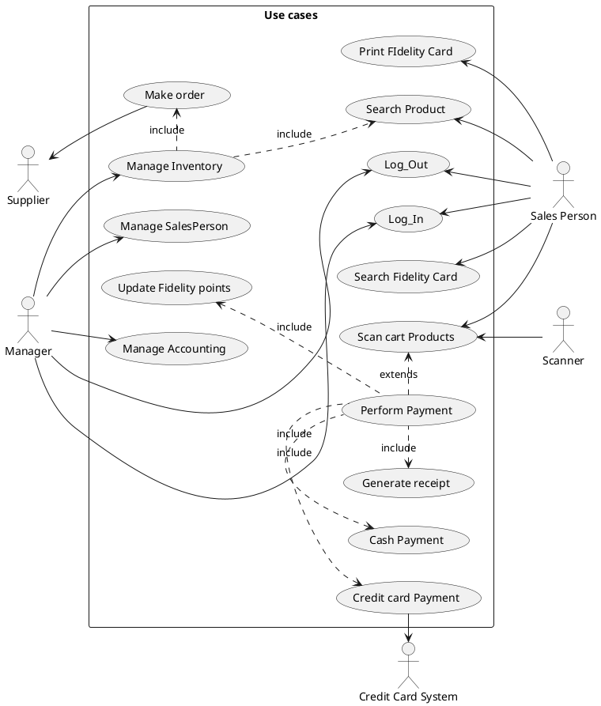
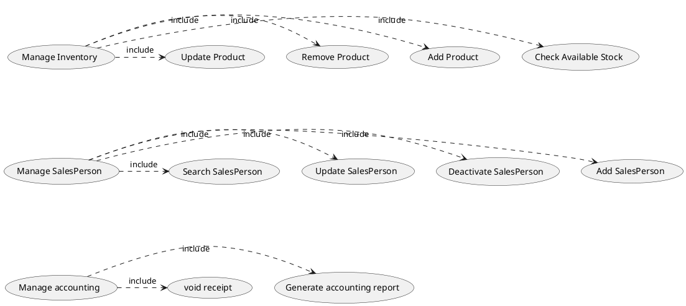
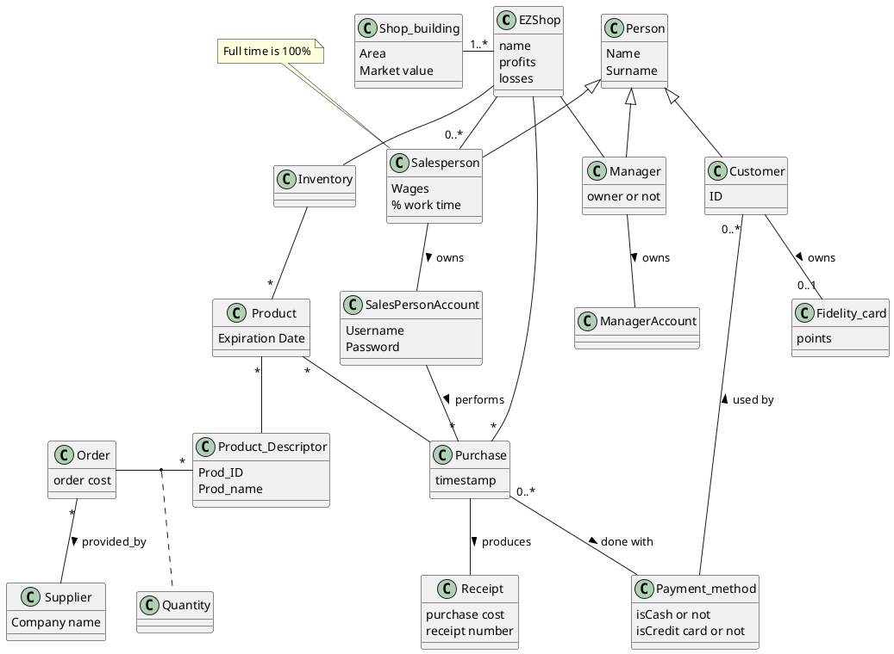

# Requirements Document 

Authors: Marcelo Coronel, Mostafa Asadollahy, Tommaso Natta, Zissis Tabouras

Date: 21/04/2020

Version: #1

# Contents

- [Essential description](#essential-description)
- [Stakeholders](#stakeholders)
- [Context Diagram and interfaces](#context-diagram-and-interfaces)
	+ [Context Diagram](#context-diagram)
	+ [Interfaces](#interfaces) 
	
- [Stories and personas](#stories-and-personas)
- [Functional and non functional requirements](#functional-and-non-functional-requirements)
	+ [Functional Requirements](#functional-requirements)
	+ [Non functional requirements](#non-functional-requirements)
- [Use case diagram and use cases](#use-case-diagram-and-use-cases)
	+ [Use case diagram](#use-case-diagram)
	+ [Use cases](#use-cases)
    	+ [Relevant scenarios](#relevant-scenarios)
- [Glossary](#glossary)
- [System design](#system-design)
- [Deployment diagram](#deployment-diagram)

# Essential description

Small shops require a simple application to support the owner or manager. A small shop (ex a food shop) occupies 50-200 square meters, sells 500-2000 different Product types, has one or a few cash registers 
EZShop is a software application to:
* manage sales
* manage inventory
* manage customers
* support accounting


# Stakeholders


| Stakeholder name  | Description | 
| ----------------- |:-----------:|
|      Manager             |  Manages the SalesPersons and he is responsible for managing the inventory stock  | 
| Salesperson | He/She is the person who confirms the purchases made by the client|
| Client | Accesses the shop to get necessary Products and pay for them |
| Supplier | Manages and receives the order made by the manager |
| Maintenance | Offers technical support in case of mulfunction of the system |
| Credit card system| Manages the payment when the client pays thought a credit card|
| Scanner| It is a device that will detect the physical Product in the inventory catalogue

# Context Diagram and interfaces

## Context Diagram





## Interfaces

| Actor | Logical Interface | Physical Interface  |
| ------------- |:-------------|:-----|
| Manager | Application GUI or Web interface | Screen keyboard on PC  |
| SalesPerson | Application GUI | Touch screen on POS|
| Credit Card System| Payment gateway API | Dedicated console |
| Scanner | Scanner API | Scanning device |
# Stories and personas

The following personas and stories are meant to cover different profiles of the Salesperson

Rebecca is 35, works as a sales person. She has a child and she is not married. When going to work she doesn't need to have more trouble due to the software she will have to use during her shift. She doesn't care about advanced or complicated operations and wants to perform what is necessary fast and without any problems and the least interaction with the clients as possible. 

David is 62, works at the counter of a shop and has two children and one grandchild. He doesn't like technology and the most high tech device in his home is the TV and an old PC. He doesn't have a smartphone or use email by choice. If it was for him he would use an old cash register instead of computer. 

Elena is 20, and is a student at the Polytechnic of Turin. She is single and works part time to pay for daily expenses. She is very familira with technology and has no problem with exploring new technology and services.

Emma is 36, and works as at the counter. She is not married and leaves alone with hers five cats. She is very active against animal cruelty and mistreatment. She is very social and likes to interact with clients and have a quick chat while performing hers job.


# Functional and non functional requirements

## Functional Requirements


| ID        | Description  |
| ------------- |:-------------|
|FR 1| Manage Sales|
|FR 1.1| Manage prices
|FR 1.1.1| Increase/decrease price of a product.
|FR 1.1.2| Increase/decrease price of category.
|FR 1.1.3| Increase/decrease price of given rate.
|FR 1.2| Manage payment method
|FR 1.2.1| Add/remove payment method
|FR 1.2.2| Add/remove accepted cards (visa, mastercard, etc)
|FR 1.3| Manage cash register
|FR 1.3.1| Create/delete cash register
|FR 1.3.2| Enable/disable cash register
|FR 1.4| Manage SalesPerson
|FR 1.4.1| Add/remove SalesPerson
|FR 1.4.2| Create/delete SalesPerson credentials 
|FR 1.5| Generate receipt
|FR 1.6| Void receipt
|FR 2| Manage Inventory
|FR 2.1| Manage product categories
|FR 2.1.1| Create/delete product categories
|FR 2.1.2| Assign/remove products from categories
|FR 2.1.3| Modify product category
|FR 2.2| Manage stock
|FR 2.2.1| Display stock of products|
|FR 2.2.2| Increase/decrease stock automatically after sale or voiding receipt|
|FR 2.2.3| Manage low stock|
|FR 2.2.3.1| Set alert for low stock|
|FR 2.2.3.2| Send notification when low stock is reached|
|FR 2.2.4| Set/unset "in stock" flag|
|FR 2.3| Manage restock|
|FR 2.3.1| Create/remove order|
|FR 2.3.2| Modify order|
|FR 2.3.3| Perform order via mail|
|FR 2.4| Manage products|
|FR 2.4.1| Add product |
|FR 2.4.2| Remove product |
|FR 2.4.3| Update product |
|FR 3| Manage customer with fidelity card|
|FR 3.1| Manage a single customer|
|FR 3.1.1|Add/remove customer|
|FR 3.1.2|Modify customer data|
|FR 3.2|Manage customer classification|
|FR 3.2.1|Create/remove customer classification|
|FR 3.2.2|Modify customer classification|
|FR 3.3|Manage customer mailing list|
|FR 3.3.1|Send email|
|FR 3.3.2|Assign/remove promotion to customer|
|FR 3.3.3|Subscribe/unsubscribe customers from mailing.|
|FR 3.4|Manage fidelity cards|
|FR 3.4.1|Create/delete fidelity card|
|FR 3.4.2|Assign/remove fidelity card to customer|
|FR 4|Support Accounting|
|FR 4.1|Reporting sales|
|FR 4.1.1|Report daily, weekly, monthly, yearly.|
|FR 4.1.2|Report sales between given dates (from date1 - to date2)|
|FR 4.1.3|Format report to csv or txt|
|FR 4.2|Electronic invoicing (with suppliers)|
|FR 4.2.1|Create electronic invoice|
|FR 4.2.2|Print electronic invoice|
|FR 4.2.3|Cancel electronic invoice|
|FR 4.2.4|Assign supplier order to electronic invoice|
|FR 4.3|Electronic billing (with customers)|
|FR 4.3.1|Create electronic bill|
|FR 4.3.2|Print electronic bill|
|FR 4.3.3|Cancel electronic bill|
|FR 4.3.4|Assign customer order to electronic bill|


### Access right, actor vs function

| Function | Manager | Sales Person | 
| ------------- |:-------------|--|
| FR 1| yes | no |
| FR 1.5| yes | yes|
| FR 2| yes | no |
| FR 3 | yes | yes |
| FR 4 | yes | no |
| FR 4.3| yes | yes |

## Non Functional Requirements
| ID        | Type        | Description  | Refers to |
| ------------- |:-------------:| :-----| -----:|
|  NFR1     | Usability | No training required for the use of the application | All FR |
|  NFR2     | Performance | All operations should complete in less than 1 sec | All FR |
|  NFR3     | Portability | HTML5 compatibility. Must support Chrome and Firefox in OS Windows 7+, Unix and Android 6+. | All FR |
|  NFR4     | Privacy     | The data of the management of the store should be private and disclosed. | All FR |
|  NFR5     | Localisation | Decimal numbers use . (dot) as decimal separator  | All FR, notably FR4|


# Use case diagram and use cases


## Use case diagram






## Use cases

### Use case 1, UC1 - Update Product

| Actors Involved        | Manager|
| ------------- |:-------------:|
|  Precondition     	| Product P exists in Inventory |
|  Post condition     	| Product P details are updated |
|  Nominal Scenario     | P has wrong or old info and must be updated  |
|  Variants     		|  |


### Use case 2, UC2 - Remove Product

| Actors Involved       |   Manager|
| ------------- |:-------------:|
|  Precondition     	| Product P exists in Iventory and Product P has not been part in a purchase during the open fiscal year |
|  Post condition    	| Product P does not exist in Inventory |
|  Nominal Scenario     | P is not sold anymore and must be removed from the Inventory |
|  Variants     		| P is part of a purchase that belongs to the open fiscal year and it cannot be removed|

### Use case 3, UC3 - Add Product

| Actors Involved       |  Manager |
| ------------- |:-------------:|
|  Precondition     	| Product P does not exist in Inventory |
|  Post condition     	| Product P exists in Iventory |
|  Nominal Scenario   	| Manager adds a P that previously was not availably to be sold |
|  Variants     		| - |


### Use case 4, UC4 - Check Available Stock

| Actors Involved       | Manager |
| ------------- |:-------------:|
|  Precondition     	| The inventory is not empty |
|  Post condition     	| The manager knows the Products in stock and out of stock |
|  Nominal Scenario     | The manager needs to know the stock availability of the Products in the inventory. He gets an indication of all the Products in stock and what is their availability |


### Use case 5, UC5 - Update Sales Person

| Actors Involved       | Manager |
| ------------- |:-------------:|
|  Precondition     	| Sales Person SP exists |
|  Post condition     	| Sales Person SP details are added or updated |
|  Nominal Scenario     | SP's personal information has changed and must be updated |
|  Variants     		| SP exists but he/she is deactivated, the manager can re-activate the account|


### Use case 6, UC6 - Deactivate Sales Person

| Actors Involved  |                        Manager          |
| ---------------- | :----------------------------------------------------------: |
| Precondition     | Sales Person SP does have an account on his/hers name |
| Post condition   | Sales Person SP account is suspended but still present in the system |
| Nominal Scenario | The manager has fired SP; SP has left the EZShop |
| Variants         | - |


### Use case 7, UC7 - Add Sales Person

| Actors Involved  |                   Manager                    |
| ---------------- | :----------------------------------------------------------: |
| Precondition     | Sales person SP does not exist |
| Post condition   | Sales person SP has an account |
|                  | Sales person SP can log in |
| Nominal Scenario | The EZShop hires SP|
| Variants         | - |


### Use case 8, UC8 - Void receipt

| Actors Involved  |                   Manager                    |
| ---------------- | :----------------------------------------------------------: |
| Precondition     | Receipt R has been generated |
| Post condition   | Receipt R has been voided |
| Nominal Scenario | R shouldn't have been generated |
| Variants         | - |


### Use case 9, UC9 - Generate accounting report

| Actors Involved  |                   Manager                    |
| ---------------- | :----------------------------------------------------------: |
| Precondition     | Accounting report is required |
| Post condition   | Accounting report has been printed on screen |
| Nominal Scenario | The manager needs to see accounting movements for a certain period |
| Variants         | The accountant of the EZShop asks for the accounting movement during a certain period, the manager can send it via mail |


### Use case 10, UC10 - Make Order

| Actors Involved  |          Manager                      |
| ---------------- | :----------------------------------------------------------: |
| Precondition     	| The remaining stock of at least one Product is deemed too low |
| Post condition    | Order O is placed |
|					| Order O has been sent to supplier S |
| Nominal Scenario 	| The manager checked the stock availability and believes that a restock is necessary. The manager creates and order, chooses a payment option and the order is sent to S |
| Variants          | - |


### Use case 11, UC11 - Log In
| Actors Involved  |                    Sales Person, Manager                 |
| ---------------- | :----------------------------------------------------------: |
| Precondition     	| Sales person SP account is present in the system |
| Post condition   	| Sales person has access to his personal account |
| Nominal Scenario 	| SP starts his/hers shift, accesses account on which transactions will be registered |
| Variants 			| SP can log-in only on his/hers account|
|					| SP lost/forgot his/hers password, The Manager can unlock the account by updating SP password|	


### Use case 12, UC12 - Log Out

| Actors Involved  |         Sales Person, Manager                         |
| ---------------- | :----------------------------------------------------------: |
| Precondition     	| Sales person SP is logged-in in his/hers account |
| Post condition   	| Sales person SP is logged-out of his/hers account |
| Nominal Scenario 	| SP has completed his/hers shift and has to log-out |
| Variants          | SP can log-out only from his/hers account |
|					| SP forgot to log-out, The manager performs the log-out by using manager privilege |


### Use case 13, UC13 - Scan Cart Products

| Actors Involved  |         Sales Person                         |
| ---------------- | :----------------------------------------------------------: |
| Precondition     	| Client CL brings to cashier CA the Products P he/she wants to buy |
|					| Cashier CA is logged-in |
| Post condition   	| Products P in cart have been scanned |
|					| The total cost of Products P is available |
| Nominal Scenario 	| CL has collected all P of interest, gives them to CA, CA scans P and informs CL of the price of his/hers purchase |
| Variants          | CL does not want to conclude the purchase, CA cancel the scanned P |


### Use case 14, UC14 - Perform Payment

| Actors Involved  |         Sales Person                         |
| ---------------- | :----------------------------------------------------------: |
| Precondition     	| Cashier CA has scanned Products P brought by client CL |
|					| Client CL chose a payment method |
| Post condition   	| The payment for Products P has been completed |
|					| Fidelity card points are updated |
|					| The system has Generated a receipt|
| Nominal Scenario 	| CA informs CL of the price, CL informs CA of the payment method, CL pays for his purchase, CL receives the receipt|
| Variants          | CL's credit card payment option is rejected, chooses a different payment method |
|					| CL does not have the required amount of money or does not want to go through with the payment, CA cancels the scanned P|

### Use case 15, UC15 - Search Fidelity Card

| Actors Involved  |         Sales Person                         |
| ---------------- | :----------------------------------------------------------: |
| Precondition     	| Fidelity card FC for client CL exist |
| Post condition   	| Client CL of fidelity card FC found |
| Nominal Scenario 	| The cashier inputs CL's name or FC number and gets the profile of CL with associated fidelity points|
| Variants          | - |

### Use case 16, UC16 - Print Fidelity Card

| Actors Involved  |         Sales Person                         |
| ---------------- | :----------------------------------------------------------: |
| Precondition     	| Fidelity card FC for client CL does not exist |
| Post condition   	| Fidelity card FC for client CL has been created |
| Nominal Scenario 	| CL asks for FC, the cashier checks that CL does not have FC , the cashier prints FC|
| Variants          | - |

#### Relevant scenarios


##### Scenario 1.1 

| Scenario |  Update Product through list |
| ------------- |:-------------:| 
|  Precondition     | Product is present in inventory |
|  Post condition     | Product has new details |
|  Step#        | Description  |
|  1    |  Manager prints on screen the list of Products in the inventory |
|  2    |  Manager selects the Product to be updated |
|  3	|  Manager updates Product |
|  4    |  Manager saves changes |

##### Scenario 1.2

| Scenario |  Update Product through Product search |
| ------------- |:-------------:| 
|  Precondition     | Product is present in inventory |
|  Post condition     | Product has new details |
|  Step#        | Description  |
|  1    |  Manager search the Products |
|  2    |  The system return the Product |
|  3	|  Manager updates Product |
|  4    |  Manager saves changes |

##### Scenario 2.1

| Scenario |  Remove Product |
| ------------- |:-------------:| 
|  Precondition     | Product is present in inventory |
|  Post condition     | Product is not present in inventory |
|  Step#        | Description  |
|  1    |  Manager search the Products |
|  2    |  The system return the Product |
|  3	|  Manager removes Product |
|  4    |  System informs manager that the deletion was successful|
|  5    |  System saves changes automatically if successful |


##### Scenario 3.1 

| Scenario |  Add Product in inventory |
| ------------- |:-------------:| 
|  Precondition     | Product is not present in inventory |
|  Post condition     | New Product is in inventory |
|  Step#        | Description  |
|  1    |  Manager selects "add Product" button |
|  2    |  System shows to manager the fields to fill |
|  3	|  Manager inserts Product details |
|  4    |  Manager saves changes |

##### Scenario 4.1 
| Scenario |  Check Available Stock |
| ------------- |:-------------:| 
|  Precondition     	| The inventory exists |
|  Post condition     	| The manager knows the Products in stock and out of stock |
|  Step#        | Description  |
|  1    |  Manager visualizes the products in a table |
|  2    |  Manager scrolls table to the end to view all the products |

##### Scenario 5.1 

| Scenario |  Update Sales Person |
| ------------- |:-------------:| 
|  Precondition     | Sales Person exists in the system |
|  Post condition     | Sales Person's details are updated |
|  Step#        | Description  |
|  1    |  Manager searches for Sales Person to be updated |
|  2    |  System shows to manager the fields to fill |
|  3	|  Manager updates Sales Person's details |
|  4    |  Manager saves changes |


##### Scenario 6.1 

| Scenario |  Deactivate Sales Person |
| ------------- |:-------------:| 
|  Precondition     | Sales Person exists in the system and is active |
|  Post condition     | Sales Person exists in the system and is not active |
|  Step#        | Description  |
|  1    |  Sales Person stops working for EZShop |
|  2    |  Manager searches for Sales Person to decativate |
|  3    |  System shows to manager the deactivate option |
|  4	|  Manager deactivates Sales Person |
|  5    |  Manager saves changes |


##### Scenario 7.1 

| Scenario |  Add Sales Person |
| ------------- |:-------------:| 
|  Precondition     | Sales Person does not exists in the system |
|  Post condition     | Sales Person exists in the system |
|  Step#        | Description  |
|  1    |  Sales Person starts working for EZShop |
|  2    |  Manager creates Sales Person account |
|  3    |  Manager activates Sales Person account |
|  5    |  Manager saves changes |


##### Scenario 7.2

| Scenario |  Add Sales Person |
| ------------- |:-------------:| 
|  Precondition     | Sales Person exists in the system but it is not active |
|  Post condition     | Sales Person exists in the system |
|  Step#        | Description  |
|  1    |  Sales Person starts working for EZShop |
|  2    |  Manager creates Sales Person account |
|  3    |  Manager activates Sales Person account |
|  5    |  Manager saves changes |


##### Scenario 8.1 

| Scenario |  Void a receipt |
| ------------- |:-------------:| 
|  Precondition     | Receipt has been generated and must be included in accounting |
|  Post condition     | Receipt is void and does not count in accounting |
|  Step#        | Description  |
|  1    |  Sales Person generates a receipt |
|  2    |  Sales Person tag's the receipt as "to_be_void" |
|  3    |  Manager accesses receipts with tag "to_be_void" |
|  5    |  Manager makes receipt void |
|  6    |  Receipt is indicated as void |


##### Scenario 9.1 

| Scenario |  Void a receipt |
| ------------- |:-------------:| 
|  Precondition     | Receipt has been generated and must be included in accounting |
|  Post condition     | Receipt is void and does not count in accounting |
|  Step#        | Description  |
|  1    |  Sales Person generates a receipt |
|  2    |  Sales Person tag's the receipt as "to_be_void" |
|  3    |  Manager accesses receipts with tag "to_be_void" |
|  5    |  Manager makes receipt void |
|  6    |  Receipt is indicated as void |


##### Scenario 10.1 

| Scenario |  Order made to restock inventory |
| ------------- |:-------------:| 
|  Precondition     | One or more Products in the inventory need restock |
|  Post condition     | The supplier is informed of the order |
|  Step#        | Description  |
|  1    |  Manager chooses "make order" in in the system  |
|  2    |  System shows to manager empty list order |
|  3	|  Manager inserts Products to order |
|  4    |  Manager chooses the Supplier to whom to send the order |
|  5	|  Manager chooses payment option|
|  6    |  Manager confirms order |


##### Scenario 11.1 

| Scenario |  Sales Person performs log-in to his/hers account|
| ------------- |:-------------:| 
|  Precondition     | Sales Person is not logged-in to his/hers account |
|  Post condition     | Sales Person is logged-in to his/hers account  |
|  Step#        | Description  |
|  1    |  Sales Person starts his/hers shift  |
|  2    |  Sales Person uses his/hers password and username to access his/hers account |


##### Scenario 11.2 

| Scenario |  Manager performs log-in to his/hers account|
| ------------- |:-------------:| 
|  Precondition     | Manager is not logged-in to his/hers account |
|  Post condition     | Manager is logged-in to his/hers account  |
|  Step#        | Description  |
|  1    |  Manager wants to access his/hers account  |
|  2    |  Manager uses his/hers password and username to access his/hers account |


##### Scenario 12.1 

| Scenario |  Sales Person performs log-out from his/hers account|
| ------------- |:-------------:| 
|  Precondition     | Sales Person is logged-in to his/hers account |
|  Post condition     | Sales Person is not logged-in to his/hers account  |
|  Step#        | Description  |
|  1    |  Sales Person ends his/hers shift  |
|  2    |  Sales Person uses log-out feature to log-out from his/hers account |


##### Scenario 12.2 

| Scenario |  Manager performs log-out from his/hers account|
| ------------- |:-------------:| 
|  Precondition     | Manager is logged-in to his/hers account |
|  Post condition     | Manager is not logged-in to his/hers account  |
|  Step#        | Description  |
|  1    |  Manager wants to exit his/hers account  |
|  2    |  Manager uses log-out feature to log-out from his/hers account |


##### Scenario 13.1 

| Scenario |  Scan products in Cart with scanner |
| ------------- |:-------------:| 
|  Precondition     | Client has a cart of products he/she wants to purchase |
|  Post condition     | The list of products in the cart is created in the system |
|  Step#        | Description  |
|  1    |  Client brings products to the Sales Person|
|  2    |  The Sales Person uses external scanning device to scan the barcode of each product|
|  3    |  The list of scanned product's is available to the Sales Person|

##### Scenario 13.2

| Scenario |  Scan products in Cart by search |
| ------------- |:-------------:| 
|  Precondition     | Client has a cart of products he/she wants to purchase |
|  Post condition     | The list of products in the cart is created in the system |
|  Step#        | Description  |
|  1    |  Client brings products to the Sales Person|
|  2    |  The Sales Person types to the system the ID of each product|
|  3    |  The list of scanned product's is available to the Sales Person|


##### Scenario 14.1 

| Scenario |  pay with credit card |
| ------------- |:-------------:| 
|  Precondition     | Cashier has scanned the Products in the shopping cart of the client |
|  Post condition     | Client payed for his/hers purchase with credit card |
|  Step#        | Description  |
|  1    |  Client chooses to pay with credit card|
|  2    |  Cashier informs the system |
|  3	|  Client reaches credit card reader device with his/hers credit card and inserts credentials|
|  4    |  The system gets the commit of the transaction from the credit card system |
|  5    |  Receipt is printed |


##### Scenario 14.2 
| Scenario |  pay with cash |
| ------------- |:-------------:| 
|  Precondition     | Cashier has scanned the Products in the shopping cart of the client |
|  Post condition     | Client payed for his/hers purchase in cash  |
|  Step#        | Description  | 
|  1    |  Client chooses to pay with cash|
|  2    |  Cashier informs the system |
|  3	|  Cashier receives money from client|
|  4    |  The system gets the commit of the transaction by the cashier|
|  5    |  Receipt is printed |


##### Scenario 15.1 

| Scenario |  Client wants to know how many points he/she has  |
| ------------- |:-------------:| 
|  Precondition     | Client has a fidelity card |
|  Post condition     | Client is aware of the amount of points accumulated |
|  Step#        | Description  |
|  1    |  Client informs the Sales Person about the Id of the fidelity card or the name of the owner|
|  2    |  Sales Person inputs these details into the system |
|  3	|  The system shows to the Sales Person the profile of the customer and the points accumulated in the fidelity card|
|  4    |  The sales Person informs the client about the points |


##### Scenario 16.1 

| Scenario |  Client wants to own a fidelity card  |
| ------------- |:-------------:| 
|  Precondition     | Client does not have a fidelity card |
|  Post condition     | Client has a fidelity card on his/hers name |
|  Step#        | Description  |
|  1    |  Client informs the Sales Person that he/she would like a fidelity card|
|  2    |  The Sales Person accesses the fidelity card creation tab |
|  3	|  The Sales Person inserts client's details to be related to the fidelity card|
|  4    |  Sales person confirms creation and the system assigns the fidelity card ID |
|  5    |  Sales Person prints fidelity card |


##### Scenario 16.2 

| Scenario |  Client has lost the printed fidelity card  |
| ------------- |:-------------:| 
|  Precondition     | Client fidelity card registered but wants to print a physical card |
|  Post condition     | Client has a printed fidelity card |
|  Step#        | Description  |
|  1    |  Client informs the Sales Person that he/she would like to print fidelity card|
|  2    |  The Sales Person search for the client account by name or by fidelity card ID |
|  3	|  The system shows client profile |
|  4    |  Sales Person selects to print the card for that profile |

# Glossary


# System Design

Not really meaningful in this case.  Only software components are needed.

# Deployment Diagram 

Client server model. The application runs on a server or virtual machine, any salesperson accesses it through a POS. The manager can access it though a destop application or access the server though a web interface

```plantuml
artifact "EZShop Application" as ezshop
node "Web Interface" as wi
node "server" as s
node "POS" as pc
s -- wi
s -- ezshop
s -- "*" pc
```

